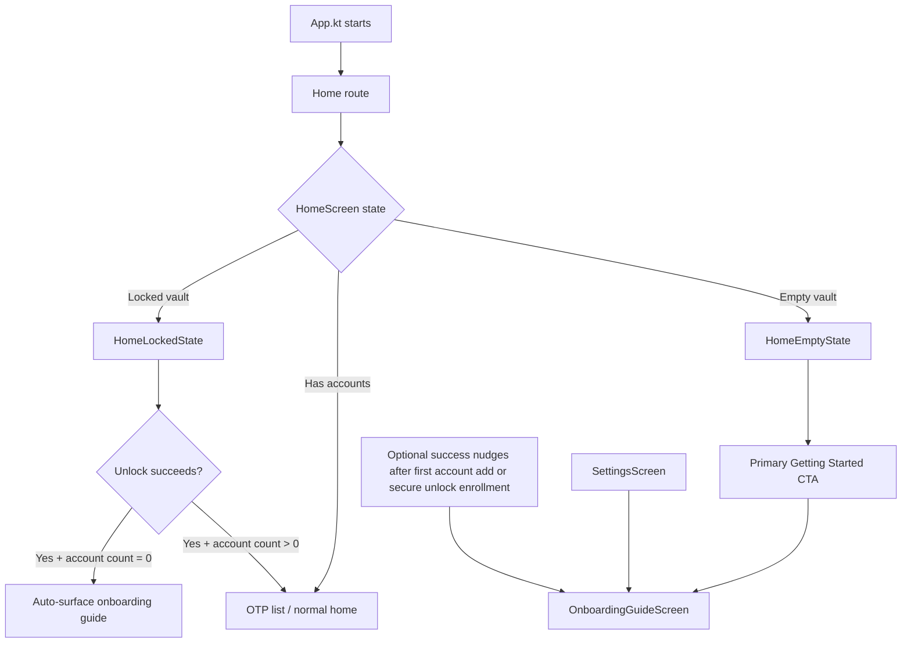
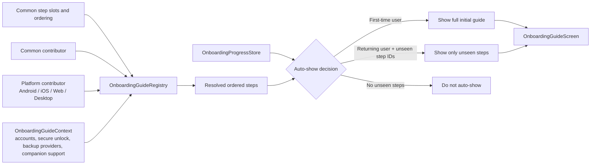
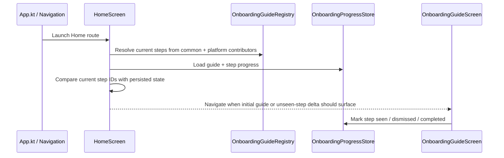
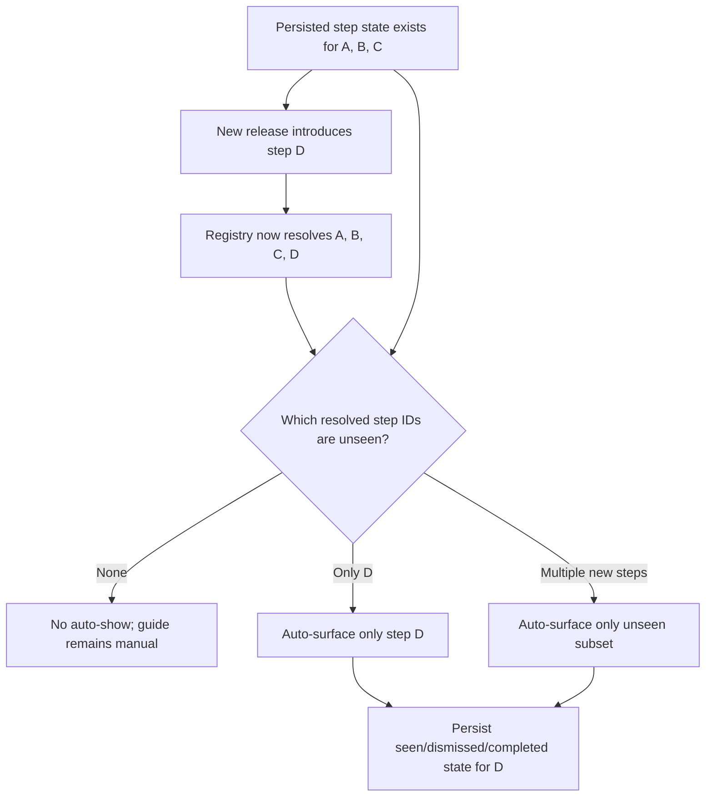

# Modular Onboarding Guide

## Goal

Add a non-blocking onboarding guide for the Compose app that:

1. is broken into modular steps instead of a single monolithic walkthrough
2. keeps a shared cross-platform structure and ordering in `commonMain`
3. lets each platform contribute, replace, or omit steps based on capability
4. uses platform-specific copy for steps such as secure unlock
5. can be resumed later from the app instead of trapping the user in a mandatory first-run wizard

## Product direction

The onboarding guide should behave like a guided checklist layered onto the existing app, not like a separate first-run app shell.

Locked defaults for this plan:

1. Do **not** replace the existing startup/navigation flow with a mandatory onboarding stack.
2. Add a dedicated **Getting Started / Onboarding Guide** route that can be entered manually or auto-surfaced when useful.
3. Make **Add your first account** the primary required step because it is the shortest path to first value.
4. Keep **secure unlock**, **backup/restore**, **import/export guidance**, and **companion sync** as optional capability-driven steps.
5. Show only steps that the current runtime and platform can actually support.
6. Persist both:
   - a guide-level `hasSeenInitialOnboardingGuide` flag
   - per-step seen/dismissed/completed state keyed by stable step ID
7. Distinguish clearly between:
   - a first-time user who should see the full initial guide
   - a returning user who has already seen the guide and has no new steps
   - a returning user who has already seen old steps but now has a newly introduced unseen step

## Why this needs to be modular

The app already contains the operational pieces that a new user needs, but today they are scattered across existing screens:

1. `App.kt` launches into `Home`.
2. `HomeScreen` branches into loading, locked, empty-vault, or OTP-list states.
3. `AddAccountScreen` already supports the real first-win path.
4. `SettingsScreen` already holds backup/import/export entry points.
5. Secure unlock is platform-specific and not uniformly available.
6. Companion or secondary-device flows are relevant only on supported platforms.

The onboarding work is therefore mostly about:

1. assembling existing flows into a coherent guide
2. deciding where the guide is injected into current navigation
3. persisting progress at the guide and per-step levels
4. handling new step introduction without replaying old onboarding

## Current app flow and where onboarding is injected

The guide should be inserted into the existing flow at the points where onboarding is naturally useful, rather than becoming a hard prerequisite for opening the app.

### Injection points to wire during implementation

1. **Route registration**
   - `NavigationRoutes.kt` adds a typed onboarding destination.
   - `App.kt` wires the route into the existing navigation tree.

2. **Auto-show injection**
   - `HomeScreen` decides whether onboarding should be auto-presented after the app reaches a meaningful usable state.
   - The most important first-run case is: unlock succeeded and the vault is still empty.

3. **Manual re-entry injection**
   - `HomeEmptyState` gets a clear “Getting Started” entry point.
   - `SettingsScreen` gets an always-available re-entry path.

4. **Contextual nudge injection**
   - After the first account is added, or after secure unlock is enabled, the app may surface the guide again only when there are still relevant unseen steps.

## Step resolution and guide assembly

The final guide should not be hardcoded as one giant list. It should be assembled from stable step slots plus common/platform contributors.

### Shared onboarding domain

Add a new common package under `composeApp/src/commonMain/.../onboarding/`, for example:

- `OnboardingStepSlot.kt`
- `OnboardingGuideStep.kt`
- `OnboardingGuideAction.kt`
- `OnboardingGuideContext.kt`
- `OnboardingStepContributor.kt`
- `OnboardingGuideRegistry.kt`
- `OnboardingProgressStore.kt`

Recommended responsibilities:

1. **Stable step slots and IDs**
   - Canonical slots and ordering live in common code.
   - Example slots:
     - `ADD_FIRST_ACCOUNT`
     - `MANAGE_ACCOUNTS`
     - `SECURE_UNLOCK`
     - `IMPORT_OR_RESTORE`
     - `BACKUP_AND_RESTORE`
     - `COMPANION_SYNC`

2. **Contributor-based step resolution**
   - Common code provides the default shared steps.
   - Platform code can replace, enrich, or omit steps for specific slots.
   - Unsupported steps resolve to no card at all.

3. **Context-driven availability**
   - `OnboardingGuideContext` should expose the runtime facts needed for step availability and completion:
     - current account count
     - whether secure unlock exists and is ready
     - whether camera QR import exists
     - whether clipboard/image QR import exists
     - available backup providers
     - companion sync availability

4. **Progress persistence**
   - Persist both guide-level and step-level state.
   - Recommended stored shape:
     - `hasSeenInitialOnboardingGuide: Boolean`
     - `stepStates: Map<StepId, StepState>`
   - `StepState` should support at least:
     - `seenAt`
     - `dismissedAt`
     - `completedAt`
     - optional `contentRevisionSeen`

5. **Prefer derived completion over manual flags**
   - First account step completes when `accountCount > 0`.
   - Secure unlock completes when secure unlock is actually ready/enrolled.
   - Backup-related steps can derive from real configured state where feasible.
   - Purely informational steps can still be dismissed or explicitly completed.

## Sequence of how the guide is surfaced

This is the runtime sequence to keep in mind while implementing entry-point injection and auto-show rules.

## Step model

### Required first-win step

1. **Add your first account**
   - explain the currently supported input methods on this platform
   - route to `AddAccount`
   - mark complete when at least one account exists

Dynamic copy should describe only the real add methods available on the current platform:

- Android/iOS: scan QR, paste/manual URI
- Web/Desktop: paste QR image where supported, paste/manual URI
- fallback everywhere: manual/pasted `otpauth://` URI

### Shared optional steps

1. **Manage your accounts**
   - explain current real capabilities only: browse, view OTPs, delete accounts
   - do not promise rename, reorder, folders, or tags

2. **Import or restore existing data**
   - explain current backup import/export entry points in settings
   - keep copy honest about what exists today
   - do not expand scope to a brand-new third-party import UI in v1

3. **Back up your vault**
   - explain why backups matter
   - route to backup providers/settings entry points
   - platform copy can reflect actual providers available at runtime

### Platform-specific optional steps

1. **Secure unlock**
   - Android: biometric unlock wording
   - iOS: Face ID / Touch ID wording
   - Web: WebAuthn / device credential wording
   - Desktop: omitted entirely for now

2. **Companion sync**
   - shown only where companion sync is available and relevant

## First-time users, returning users, and newly added steps

The key product rule is that old onboarding should not replay just because a new feature added one more step.

### State buckets

1. **Brand-new user**
   - `hasSeenInitialOnboardingGuide = false`
   - guide can auto-show in its full initial form

2. **Returning user with no unseen steps**
   - `hasSeenInitialOnboardingGuide = true`
   - every currently resolved step already has seen/completed/dismissed state
   - no auto-show; manual re-entry only

3. **Returning user with newly added unseen steps**
   - `hasSeenInitialOnboardingGuide = true`
   - previously known steps have persisted state
   - at least one newly resolved stable step ID has no persisted state yet
   - only the unseen step subset should auto-surface

### Delta flow when a new feature drops

### Why stable step IDs matter

If the app originally shipped with `A`, `B`, and `C`, and a later release adds `D`, then:

1. existing users who already saw `A/B/C` should not be forced through those again
2. the guide should calculate `resolvedStepIds - knownStepIds`
3. only the delta should be surfaced automatically
4. the delta can still be completed, dismissed, or ignored without affecting the earlier step history

Optional `contentRevisionSeen` is a future escape hatch only if a materially changed old step ever needs intentional re-surfacing.

## UX recommendations

1. **Guide shape**
   - use a checklist/progress view, not a full-screen slideshow
   - keep it resumable and skippable

2. **Permission priming**
   - explain the benefit of camera, biometrics, or WebAuthn before the system prompt appears

3. **Progress visibility**
   - clearly separate required steps from optional steps
   - keep the progress model lightweight and derived from real app state where possible

4. **Dismiss and resume**
   - users must be able to skip onboarding without losing app access
   - the guide remains discoverable later

5. **Contextual surfacing**
   - first-time onboarding can be broader
   - later nudges should be smaller and only point to unseen steps

## Implementation roadmap

### Phase 0 - Lock onboarding shape, first-run triggers, and required-vs-optional step policy

1. Confirm that v1 is a non-blocking guide, not a forced startup wizard.
2. Lock the initial step slots and ordering.
3. Lock first-run trigger rules:
   - empty vault after unlock
   - empty-state CTA
   - settings re-entry
4. Lock the persistence model:
   - guide-level initial-onboarding flag
   - per-step seen/dismissed/completed flags
   - stable step IDs
   - whether `contentRevisionSeen` is included in v1
5. Lock auto-show rules for:
   - first-time initial guide
   - returning user with no unseen steps
   - returning user with newly added unseen steps only
6. Lock scope boundaries for v1:
   - guide existing features only
   - no new account-management capabilities
   - no new third-party import UI

### Phase 1 - Add common onboarding domain models, registry, and progress persistence

1. Add the common onboarding package and data model.
2. Add contributor contracts and slot resolution logic.
3. Add lightweight progress storage for:
   - initial guide seen flag
   - per-step seen/dismissed/completed state
4. Add auto-show resolution logic for full-guide vs unseen-steps-only modes.
5. Add tests for:
   - ordering
   - override rules
   - unsupported-step omission
   - first-time user sees full guide
   - returning user with unseen new step sees only unseen steps

### Phase 2 - Add onboarding UI route, screen, and reusable step components

1. Add `OnboardingGuideScreen`.
2. Add `components/onboarding/*` UI pieces.
3. Add a typed route in `NavigationRoutes.kt`.
4. Wire the route into `App.kt`.
5. Add UI states for:
   - loading
   - no available steps
   - mixed required/optional steps
   - completed guide

### Phase 3 - Add common onboarding steps for first account, manage accounts, and import/export guidance

1. Add the shared contributor for the common step slots.
2. Build dynamic copy for add-account methods based on QR/clipboard capability.
3. Route relevant CTAs to existing screens:
   - `AddAccount`
   - `Accounts`
   - `Settings`
4. Keep all copy accurate to current product behavior.

### Phase 4 - Add platform-specific contributors for secure unlock and other capability-gated steps

1. Android contributor:
   - secure unlock step with biometric wording
2. iOS contributor:
   - secure unlock step with Face ID / Touch ID wording
3. Web contributor:
   - secure unlock step with WebAuthn/device credential wording
4. Desktop contributor:
   - omit secure unlock slot
5. Extend contributor logic later for backup-provider- or companion-specific messaging if needed.

### Phase 5 - Wire contextual entry points and completion updates across Home, Add Account, and Settings

1. `HomeScreen`
   - surface onboarding entry after first unlock when the vault is empty
   - surface unseen-step-only nudges when new stable step IDs appear
2. `HomeEmptyState`
   - add a direct “Getting Started” / guide CTA
3. `SettingsScreen`
   - add re-entry into onboarding guide
4. `AddAccountScreen` / `AccountsViewModel`
   - refresh onboarding completion when the first account is added
5. Secure unlock settings flows
   - refresh onboarding completion when enrollment succeeds

### Phase 6 - Add tests and validate Android, iOS, Desktop, and Web assembly

1. Common tests:
   - step ordering
   - contributor override behavior
   - completion derivation rules
2. Platform tests where feasible:
   - secure unlock step present on Android/iOS/Web
   - secure unlock step absent on Desktop
3. Manual validation matrix:
   - first open with empty vault
   - first account add by available methods
   - secure unlock enabled/disabled
   - backup providers available/unavailable
   - guide dismissed and reopened
   - existing user with all old steps seen gets no auto-show
   - existing user with new step `D` only gets step `D`

## Files likely impacted during implementation

- `composeApp/src/commonMain/kotlin/tech/arnav/twofac/App.kt`
- `composeApp/src/commonMain/kotlin/tech/arnav/twofac/navigation/NavigationRoutes.kt`
- `composeApp/src/commonMain/kotlin/tech/arnav/twofac/screens/HomeScreen.kt`
- `composeApp/src/commonMain/kotlin/tech/arnav/twofac/screens/SettingsScreen.kt`
- `composeApp/src/commonMain/kotlin/tech/arnav/twofac/screens/AddAccountScreen.kt`
- `composeApp/src/commonMain/kotlin/tech/arnav/twofac/components/home/HomeEmptyState.kt`
- `composeApp/src/commonMain/kotlin/tech/arnav/twofac/components/onboarding/*` (new)
- `composeApp/src/commonMain/kotlin/tech/arnav/twofac/screens/OnboardingGuideScreen.kt` (new)
- `composeApp/src/commonMain/kotlin/tech/arnav/twofac/onboarding/*` (new)
- `composeApp/src/commonMain/kotlin/tech/arnav/twofac/di/modules.kt`
- `composeApp/src/androidMain/kotlin/tech/arnav/twofac/di/AndroidModules.kt`
- `composeApp/src/iosMain/kotlin/tech/arnav/twofac/di/IosModules.kt`
- `composeApp/src/wasmJsMain/kotlin/tech/arnav/twofac/di/WasmModules.kt`
- `composeApp/src/desktopMain/kotlin/tech/arnav/twofac/di/DesktopModules.kt`

## Explicitly out of scope for v1

1. Replacing the whole app with a forced onboarding wizard.
2. Adding new account-management capabilities such as rename, reorder, folders, or tags.
3. Adding a brand-new third-party import UI on top of the existing importer adapters.
4. Introducing a large analytics/telemetry system as a prerequisite for shipping the guide.

## Summary

The safest implementation path is to add a shared, resume-friendly onboarding checklist that sits on top of the current routing structure, with guide assembly driven by common slots plus platform contributors.

That approach keeps the flow honest, lets the app explain platform-specific capabilities without pretending they exist everywhere, and supports the critical delta behavior where existing users only see newly introduced onboarding steps instead of replaying the whole guide.
