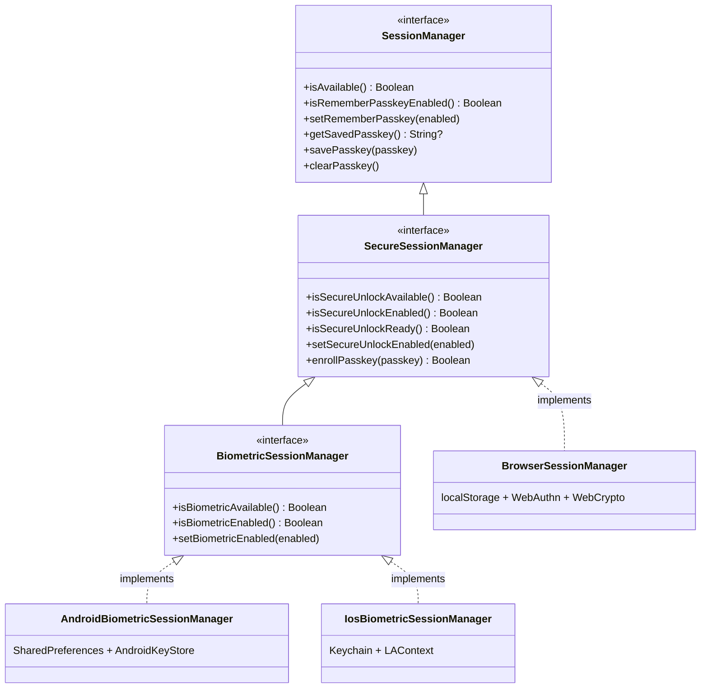
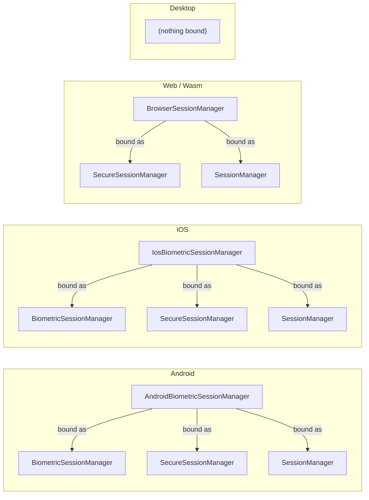
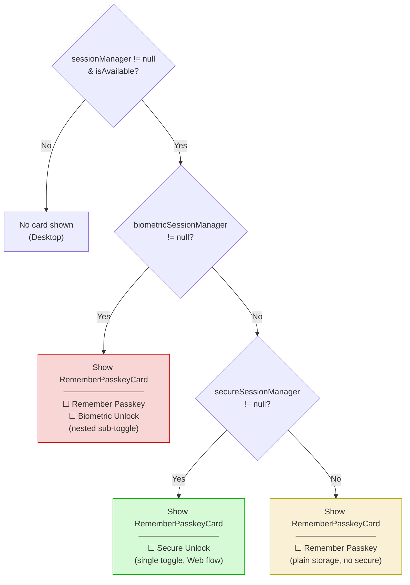
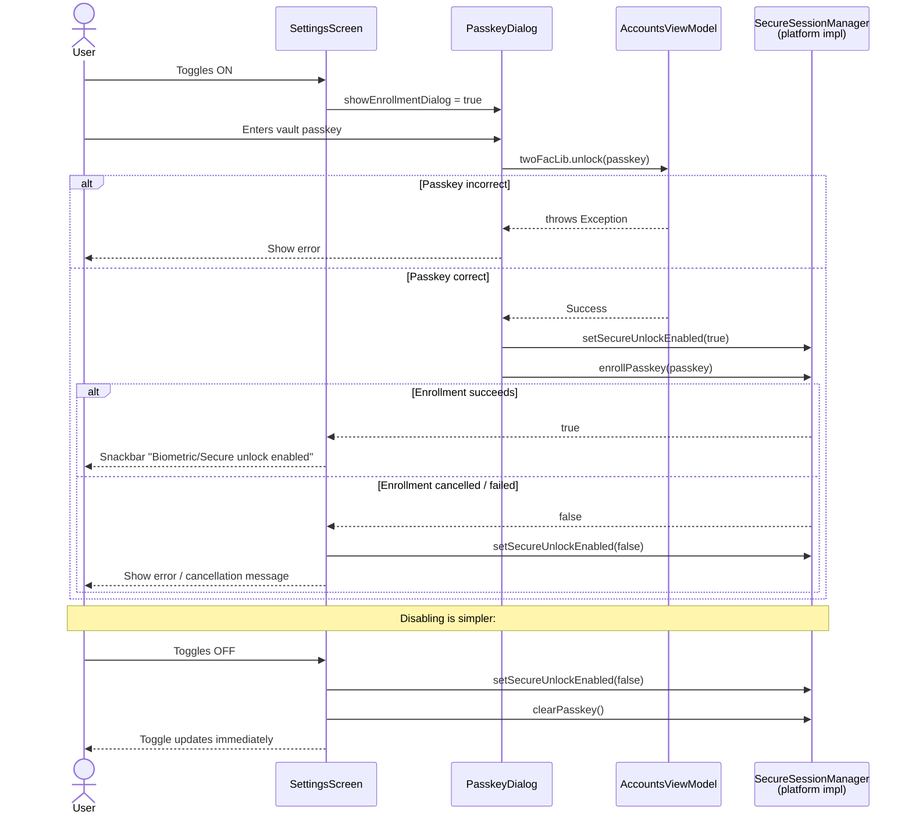
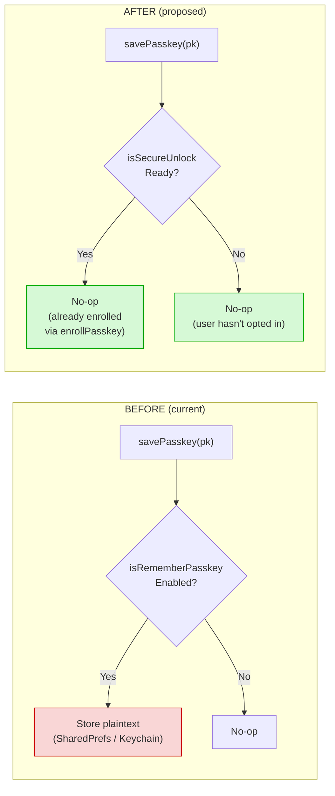
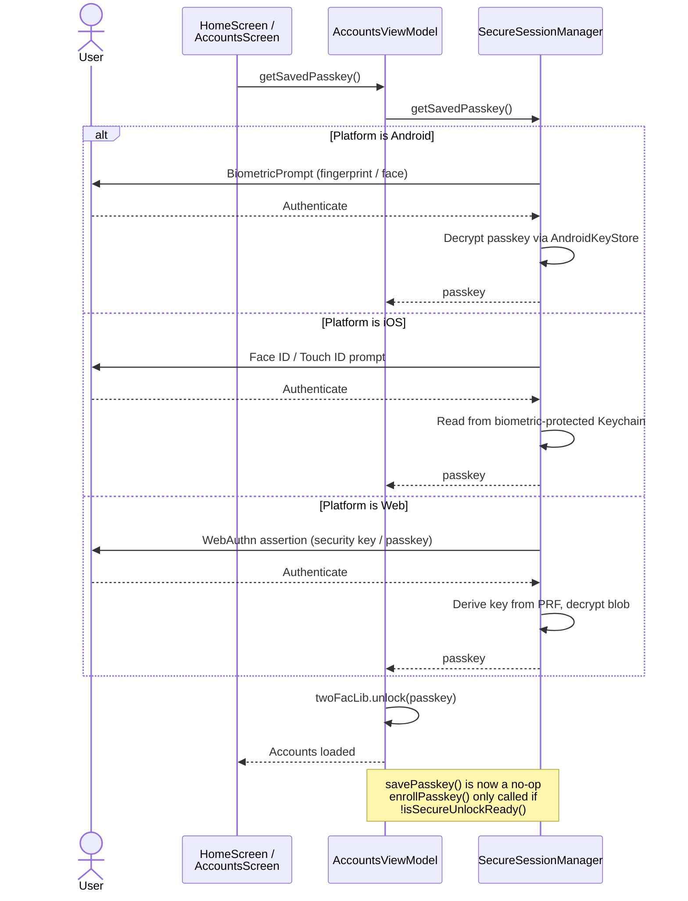
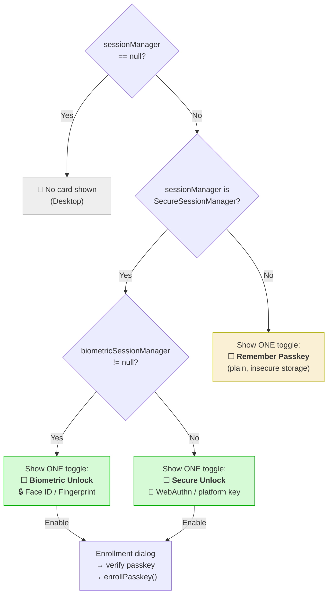
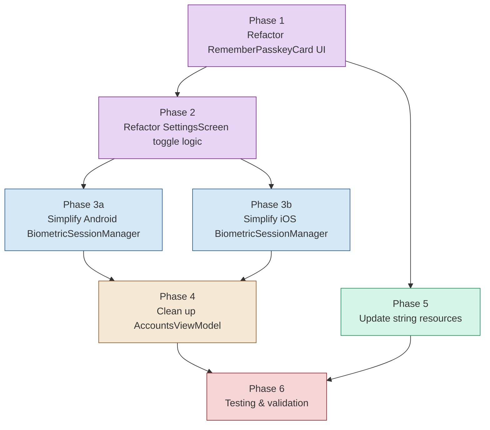
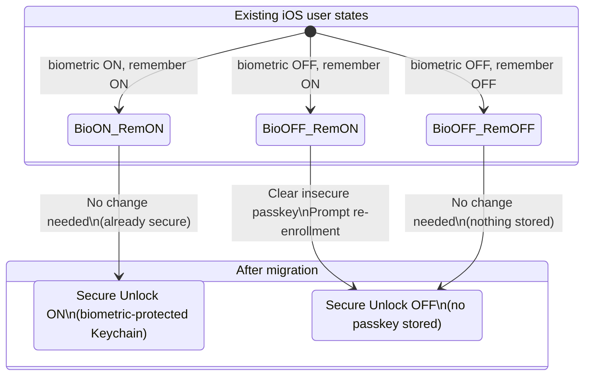

# Plan 24: Consolidate Passkey Storage & Secure Session Toggles

## Problem

On platforms with a `SecureSessionManager` (Android, iOS, Web), there are currently **two
conceptual toggles** exposed in the Settings UI:

1. **"Remember Passkey"** – persist the vault passkey across sessions (plain storage on iOS, or
   in-memory on Web).
2. **"Biometric Unlock" / "Secure Unlock"** – protect the persisted passkey with biometric
   authentication or a WebAuthn credential.

The current split creates confusion:

- On **Android** the passkey is *always* encrypted via AndroidKeyStore + biometric prompt;
  enabling "Remember Passkey" without biometric has no meaningful plaintext fallback.
  The biometric toggle and remember-passkey toggle are really the same thing.
- On **iOS** the `IosBiometricSessionManager` allows "remember passkey" in plain Keychain
  mode (without biometric access control). But there is no good reason to store a 2FA vault
  passkey without biometric protection on a device that *supports* biometrics.
- On **Web** (BrowserSessionManager) the single "Secure Unlock" toggle already collapses
  both concepts into one because WebAuthn is the only storage mechanism. This is the correct
  approach.
- On **Desktop** no `SessionManager` is bound at all, so no toggle appears.

### Desired behavior

> If a `SecureSessionManager` is available on the platform, show **one single toggle**
> ("Secure Unlock" / "Biometric Unlock") that both enables passkey persistence *and* secures
> it. No separate "Remember Passkey" toggle should appear.
>
> The plain "Remember Passkey" toggle (persist without secure protection) should only appear
> on platforms where a `SessionManager` exists but *no* `SecureSessionManager` is available.
> (Currently no such platform exists, but the architecture should support it.)

---

## Current Architecture (reference)

### Interface hierarchy



### Platform DI bindings



### Key files

| File | Role |
|------|------|
| `composeApp/.../session/SessionManager.kt` | Base interface |
| `composeApp/.../session/SecureSessionManager.kt` | Secure unlock interface |
| `composeApp/.../session/BiometricSessionManager.kt` | Biometric sub-interface |
| `composeApp/.../screens/SettingsScreen.kt` | Settings UI logic (lines 109-332, 696-780) |
| `composeApp/.../components/settings/RememberPasskeyCard.kt` | Two-toggle card component |
| `composeApp/.../viewmodels/AccountsViewModel.kt` | `savePasskey` / `enrollPasskey` calls |
| `composeApp/src/androidMain/.../AndroidBiometricSessionManager.kt` | Android impl |
| `composeApp/src/iosMain/.../IosBiometricSessionManager.kt` | iOS impl |
| `composeApp/src/wasmJsMain/.../BrowserSessionManager.kt` | Web impl |

### Current UI toggle behavior (BEFORE)



> **Problem:** Android & iOS show two toggles (red) when they should behave like Web (green).

---

## Implementation Plan

### Phase 1: Refactor `RememberPasskeyCard` UI component

**Goal:** The card should support two distinct display modes based on what the platform offers.

#### Current state
- `RememberPasskeyCard` always shows a top-level "Remember Passkey" switch.
- It conditionally shows a nested "Biometric Unlock" sub-switch via `showBiometricToggle`.

#### Changes
- **Remove the separate biometric sub-toggle.** The card should show exactly **one** toggle.
- Introduce a sealed display mode concept:
  - **`SecureMode`** – when `SecureSessionManager` is available. Shows a single toggle
    labeled "Biometric Unlock" (Android/iOS) or "Secure Unlock" (Web). Enabling it triggers
    secure enrollment. Disabling it clears the stored passkey entirely.
  - **`PlainMode`** – when only a bare `SessionManager` is available (no secure storage).
    Shows a single "Remember Passkey" toggle that stores the passkey without extra protection.
- The component parameters simplify from 7+ toggle-related params to essentially:
  `title`, `description`, `isEnabled`, `onEnabledChanged`.
- Remove `showBiometricToggle`, `isBiometricEnabled`, `onBiometricChanged`,
  `biometricTitle`, `biometricDescription` parameters.

### Phase 2: Refactor `SettingsScreen` toggle logic

**Goal:** Collapse the two independent state variables and enrollment dialogs into one
unified flow.

#### Current state (SettingsScreen.kt lines 109-128, 297-332, 696-780)
- Two state variables: `isRememberPasskeyEnabled`, `isBiometricEnabled`
- Two enrollment dialogs: `showSecureEnrollmentDialog`, `showBiometricEnrollmentDialog`
- Branching logic on `usesGenericSecureUnlockFlow` vs `biometricSessionManager != null`

#### Changes
1. **Single state variable:** Replace `isRememberPasskeyEnabled` + `isBiometricEnabled` with
   a single `isSecureUnlockEnabled` (or keep `isRememberPasskeyEnabled` alone since it's the
   only toggle now).

2. **Unified enrollment dialog:**
   - Remove `showBiometricEnrollmentDialog` / `biometricEnrollmentError` state.
   - Remove `showSecureEnrollmentDialog` / `secureEnrollmentError` state.
   - Introduce a single `showEnrollmentDialog` / `enrollmentError` pair.

3. **Unified toggle handler (onEnabledChanged):**
   - If disabling: call `secureSessionManager.setSecureUnlockEnabled(false)` + `clearPasskey()`.
   - If enabling: show the enrollment dialog → verify passkey → call `enrollPasskey()`.
   - The dialog handler decides at runtime whether to use `biometricSessionManager.enrollPasskey()`
     or `secureSessionManager.enrollPasskey()` – both implement the same interface method.

4. **Determine card title/description at common level:**
   - If `biometricSessionManager != null` → "Biometric Unlock" title + biometric description.
   - Else if `secureSessionManager != null` → "Secure Unlock" title + secure description.
   - Else (plain `SessionManager`) → "Remember Passkey" title + plain description.
   - **Note:** The "plain SessionManager only" branch is currently dead code (no platform
     binds a bare `SessionManager`), but it keeps the architecture clean.

5. **Remove** the `usesGenericSecureUnlockFlow` variable entirely. The new logic naturally
   handles all cases via the `secureSessionManager` / `biometricSessionManager` null checks.

#### Unified enrollment flow (AFTER)



### Phase 3: Simplify platform `BiometricSessionManager` implementations

**Goal:** On Android and iOS, enabling "secure unlock" should automatically set
`isRememberPasskeyEnabled = true` (since the two are now synonymous), and disabling should
clear both.

#### `savePasskey()` behavior change across platforms



#### Android (`AndroidBiometricSessionManager`)
- `setRememberPasskey(true)` should auto-enable `secureUnlockEnabled` and vice versa.
  - Simplest approach: make `setRememberPasskey()` delegate to `setSecureUnlockEnabled()`
    when secure storage is available, so the two prefs are always in sync.
  - Or: remove the separate `remember_passkey_enabled` preference; derive it from
    `isSecureUnlockReady()`.
- `savePasskey(passkey)` (called from `AccountsViewModel` after unlock) should be a no-op
  or delegate to `enrollPasskey()` if called outside of the enrollment flow, since plaintext
  persistence shouldn't happen.
- Verify `getSavedPasskey()` always decrypts via biometric (current behavior is correct).

#### iOS (`IosBiometricSessionManager`)
- **Remove plain Keychain storage path.** Currently iOS stores the passkey in Keychain
  *without* biometric access control when biometric is disabled but remember-passkey is
  enabled. This path should be eliminated.
- `savePasskey()` → no-op (or redirect to `enrollPasskey`). Passkeys should only be stored
  via the biometric-protected enrollment path.
- `setRememberPasskey(enabled)` should delegate to `setBiometricEnabled(enabled)` so the
  two always stay in sync.
- `isRememberPasskeyEnabled()` should return `isBiometricEnabled() && isBiometricAvailable()`.

#### Web (`BrowserSessionManager`)
- Already correct – single secure flow, no plain fallback. No changes needed.

### Phase 4: Clean up `AccountsViewModel` passkey persistence

**Goal:** Ensure the post-unlock passkey persistence in `AccountsViewModel` works correctly
with the unified toggle.

#### Current state (AccountsViewModel.kt line 122-126)
```kotlin
if (passkey != null) {
    sessionManager?.savePasskey(passkey)
    sessionManagerForPostUnlockEnrollment(sessionManager, fromAutoUnlock)
        ?.enrollPasskey(passkey)
}
```

#### Changes
- When a `SecureSessionManager` is present, `savePasskey()` should NOT store plaintext.
  The platform implementations from Phase 3 already ensure this.
- The `sessionManagerForPostUnlockEnrollment()` function remains useful for re-enrolling
  on subsequent unlocks (when enrollment material was lost). No changes needed there.
- Verify the `getSavedPasskey()` path in `AccountsScreen` and `HomeScreen` auto-unlock
  still works correctly when there's only a secure path.

#### Auto-unlock flow (after changes)



### Phase 5: Update string resources

**Goal:** Adjust or add string resources to reflect the simplified single-toggle UX.

#### Changes
- Audit existing strings in `composeResources/values/strings.xml` (and localized variants):
  - `settings_remember_passkey_title` / `settings_remember_passkey_description`
  - `settings_secure_unlock_title` / `settings_secure_unlock_description`
  - `settings_biometric_title` / `settings_biometric_description`
  - `settings_biometric_unlock_enabled` / `settings_biometric_enrollment_cancelled`
  - `settings_secure_unlock_enabled` / `settings_secure_enrollment_cancelled`
- The biometric sub-toggle strings (`settings_biometric_title`, `settings_biometric_description`)
  can be removed or repurposed since the sub-toggle no longer exists.
- Keep `settings_remember_passkey_*` for the hypothetical plain-only mode.
- Ensure snackbar messages still make sense (e.g. "Biometric unlock enabled" when enabling
  on Android/iOS, "Secure unlock enabled" on Web).

### Phase 6: Testing & validation

1. **Android:** Toggle ON → biometric enrollment prompt → passkey stored encrypted.
   Toggle OFF → passkey cleared. No separate "remember passkey" toggle visible.
2. **iOS:** Toggle ON → Face ID/Touch ID enrollment → passkey in biometric Keychain.
   Toggle OFF → Keychain entry deleted. No plain Keychain storage path remains.
3. **Web:** Behavior unchanged – single "Secure Unlock" toggle using WebAuthn.
4. **Desktop:** No toggle visible (no `SessionManager` bound). Unchanged.
5. **Auto-unlock flow:** After enabling biometric/secure unlock, closing and reopening the
   app should auto-unlock via biometric prompt (Android/iOS) or WebAuthn (Web).
6. **Migration edge case:** Users who previously had "remember passkey" ON but biometric OFF
   on iOS should be migrated to biometric ON (or have their insecure passkey cleared and be
   prompted to re-enroll).

---

## Summary of Toggle Display Logic (After Changes)



## Phase Dependency Graph



## Risks & Considerations

- **iOS migration:** Existing users with plain Keychain passkeys (biometric OFF, remember ON)
  need graceful handling. Options: (a) auto-clear and prompt re-enrollment on next open,
  (b) silently migrate to biometric-protected if biometric is available.


- **Backwards compatibility of prefs:** The `remember_passkey_enabled` and
  `twofac_biometric_enabled` preference keys on Android/iOS should be kept (not renamed)
  to avoid breaking existing installs. Their semantics just become synonymous.
- **`SessionManager.savePasskey()` contract change:** Making `savePasskey()` a no-op on
  secure platforms is a semantic change. Callers relying on it to store after manual unlock
  should still work because `sessionManagerForPostUnlockEnrollment` handles re-enrollment.
