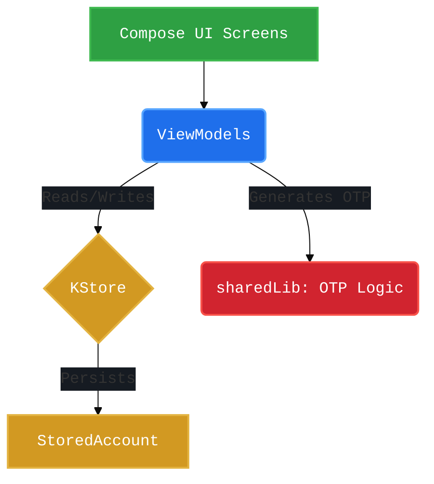
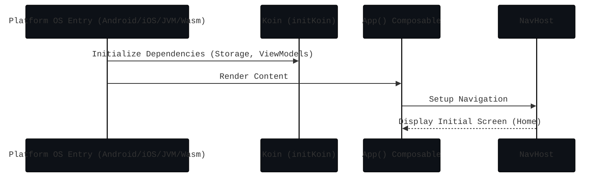

# composeApp AGENTS.md

`composeApp` is the Compose Multiplatform UI layer for Android, iOS, Desktop, and Web.

## Source-set layout

- `src/commonMain`: shared UI, navigation, DI wiring, view models, storage adapter layer
- `src/androidMain`: Android entry points (`MainActivity`, `TwoFacApplication`)
- `src/iosMain`: iOS bridge (`MainViewController`)
- `src/desktopMain`: Desktop entry point (`main.kt`)
- `src/wasmJsMain`: Web entry point (`main.kt`)

## Platform Specifics

Each target platform handles certain host-level functionality differently, usually abstracted via `Platform.*.kt` and `AppDirUtils.*.kt`.

- **Android**: Retrieves the application data directory via `Context.filesDir`.
- **Desktop (JVM)**: Retrieves the application data directory using the `user.home` system property, usually falling back to a hidden folder in the user's home directory.
- **iOS**: Uses the `NSFileManager` APIs to get the document directory.
- **Web (WasmJs)**: Usually relies on browser-level APIs like `localStorage` or `IndexedDB` underneath the abstractions provided by KStore.

## Dependency on `sharedLib`

`composeApp` relies heavily on the `sharedLib` module for its core logic instead of implementing OTP logic itself.
- **HOTP/TOTP**: The actual algorithm logic to generate tokens resides in `sharedLib`.
- **Data Models**: Classes like `StoredAccount` are defined in `sharedLib` and utilized by the UI.
- **Dependency Injection**: `composeApp` injects these dependencies using Koin. `Application.kt` ties the `storageModule` and `appModule` from the `:sharedLib` together with the `viewModelModule` defined within the UI layer.

## Architecture & Data Flow

Navigation and screens are in `commonMain`. UI relies on ViewModels to interpret data changes from KStore and the underlying sharedLib implementations.

### Data Flow Diagram

### Initialization Lifecycle

Different platforms have different entry points, but they all generally converge to injecting dependencies and starting the Compose app.

