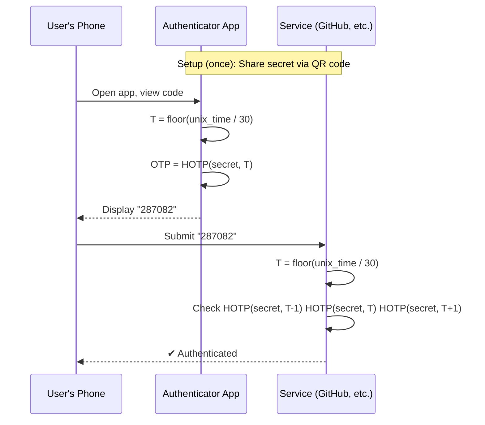
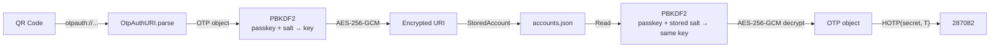
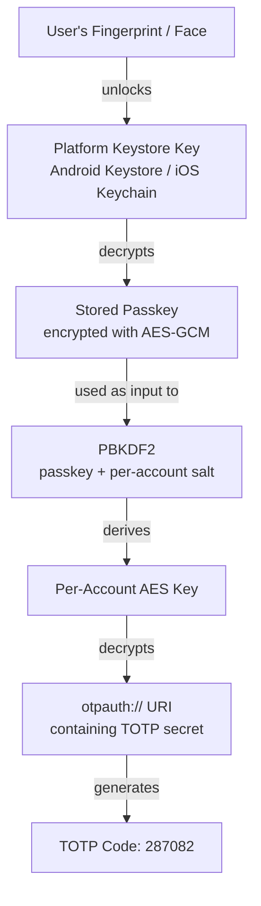
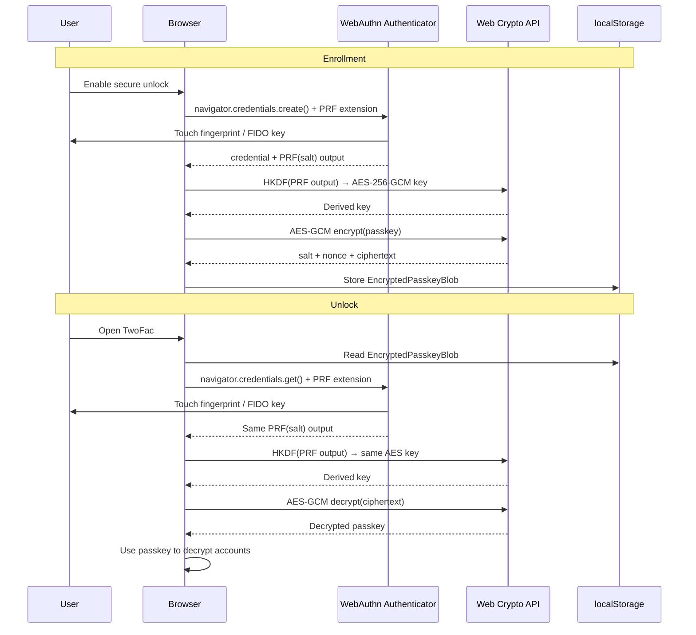
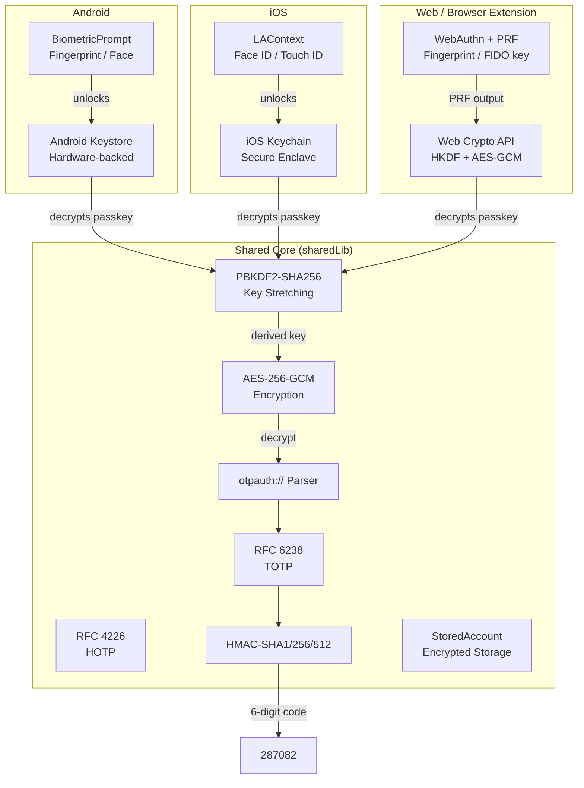

In my [previous post](https://arnav.tech/architecting-twofac-kotlin-multiplatform-module-structure), I walked through how TwoFac is structured as a Kotlin Multiplatform project—the modules, the targets, the "logic as a library" philosophy. But I deliberately left out the most interesting part: the **cryptography**.

Today, I want to take you on a deep dive into the math and code that makes a 2FA authenticator actually work. If you've ever opened Google Authenticator, watched a 6-digit code count down, and wondered _"how does this thing know the right code without talking to any server?"_—this post is for you.

We'll start from the fundamentals of HOTP and TOTP, work our way through the `otpauth://` URI format (what's inside those QR codes), and then explore how TwoFac encrypts, stores, and protects your secrets across every platform—from Android fingerprint to browser security keys.

## The Magic of Time-Based One-Time Passwords

Here's the thing that blew my mind when I first learned about TOTP: **your phone and the server never talk to each other after the initial setup**. They don't need to. They both independently generate the same 6-digit code because they share two things:

1. A **shared secret** (exchanged once, during setup)
2. The **current time** (which both sides agree on, thanks to clocks)

That's it. No network calls, no token refresh endpoints, no OAuth dance. Just pure math running on both sides, independently arriving at the same answer. It's like two people who memorised the same codebook—they can verify each other's messages without ever communicating again.

This elegance is why TOTP has become the gold standard for two-factor authentication. It's simple, it's offline-capable, and it's built on well-understood cryptographic primitives that have been analysed for decades.

## Breaking Down HOTP: The Foundation

Before we can understand time-based codes, we need to understand their predecessor: **HOTP** (HMAC-based One-Time Password), defined in [RFC 4226](https://datatracker.ietf.org/doc/html/rfc4226).

HOTP takes two inputs and produces a short numeric code:

- **K** — a shared secret key (a random byte sequence)
- **C** — a counter (an incrementing number)

The algorithm has three steps:

### Step 1: Compute HMAC-SHA1

[HMAC](https://datatracker.ietf.org/doc/html/rfc2104) (Hash-based Message Authentication Code) is a construction that combines a hash function with a secret key to produce a fixed-length "signature" of some data. For OTPs, we hash the counter value using the shared secret:

```
hmac_result = HMAC-SHA1(secret, counter)
```

This gives us a 20-byte (160-bit) hash. That's way too long for a 6-digit code though. We need to squish it down.

### Step 2: Dynamic Truncation

This is the clever part. Instead of just taking the first or last bytes (which could be predictable), RFC 4226 specifies "dynamic truncation"—we use the hash itself to decide _which_ bytes to extract:

1. Look at the **last byte** of the hash, and take its low 4 bits. This gives us an **offset** (0–15).
2. Starting at that offset, extract **4 bytes**.
3. Mask off the most significant bit (to avoid signed/unsigned issues), giving us a 31-bit integer.

Here's exactly how we do it in TwoFac's [`HOTP.kt`](https://github.com/championswimmer/TwoFac/tree/main/sharedLib/src/commonMain/kotlin/tech/arnav/twofac/lib/otp/HOTP.kt):

```kotlin
internal fun dynamicTruncate(hmac: ByteString): Int {
    // The last byte's 4 lowest bits determine the offset
    val offset = (hmac.get(hmac.size - 1) and 0x0F).toInt()

    // Extract 4 bytes starting at the offset position
    return ((hmac.get(offset).toInt() and MSB_MASK) shl 24) or
            ((hmac.get(offset + 1).toInt() and BYTE_MASK) shl 16) or
            ((hmac.get(offset + 2).toInt() and BYTE_MASK) shl 8) or
            (hmac.get(offset + 3).toInt() and BYTE_MASK)
}
```

Where `MSB_MASK = 0x7F` strips the sign bit, and `BYTE_MASK = 0xFF` grabs a full byte.

### Step 3: Modulo to N Digits

Finally, we take our 31-bit integer and modulo it by 10^digits to get a human-readable code:

```kotlin
val otp = fourBytes % 10.0.pow(digits.toDouble()).toInt()
return otp.toString().padStart(digits, '0')
```

The `padStart` is important—if the result is `7824`, a 6-digit code should be `007824`, not `7824`.

### Putting It All Together

The full OTP generation in [`HOTP.kt`](https://github.com/championswimmer/TwoFac/tree/main/sharedLib/src/commonMain/kotlin/tech/arnav/twofac/lib/otp/HOTP.kt) looks like this:

```kotlin
override suspend fun generateOTP(counter: Long): String {
    // Convert the counter to a byte array (8 bytes, big-endian)
    val counterBytes = ByteArray(8) { i ->
        ((counter shr ((7 - i) * 8)) and 0xFF).toByte()
    }

    // Decode the Base32-encoded secret
    val secretBytes = Encoding.decodeBase32(secret)

    // Compute the HMAC using the CryptoTools
    val hmac = cryptoTools.hmacSha(algorithm, ByteString(secretBytes), ByteString(counterBytes))

    // Dynamic truncation (get 4 bytes from the HMAC result)
    val fourBytes = dynamicTruncate(hmac)

    // Generate the OTP by modulo with 10^digits
    val otp = fourBytes % 10.0.pow(digits.toDouble()).toInt()

    // Pad with leading zeros if necessary
    return otp.toString().padStart(digits, '0')
}
```

To validate our implementation, we use the official [RFC 4226 test vectors](https://datatracker.ietf.org/doc/html/rfc4226#appendix-D):

| Counter | Expected OTP |
|---------|-------------|
| 0       | 755224      |
| 1       | 287082      |
| 2       | 359152      |
| 3       | 969429      |
| 4       | 338314      |

If your implementation produces these exact values for the secret `"12345678901234567890"`, you've got it right.

## From HOTP to TOTP: Adding Time

The problem with HOTP is that both sides need to keep their counters in sync. If you generate an OTP on your phone but never submit it, your counter advances while the server's stays put. This gets messy.

[RFC 6238](https://datatracker.ietf.org/doc/html/rfc6238) solves this elegantly: **replace the counter with time**. The "counter" becomes:

```
T = floor((current_unix_time - T0) / time_step)
```

Where `T0` is typically `0` (Unix epoch) and `time_step` is usually `30` seconds. So at any given moment, both your phone and the server compute the same time-step number, use it as the counter input to HOTP, and independently arrive at the same OTP.

Here's how simple the TOTP implementation becomes in [`TOTP.kt`](https://github.com/championswimmer/TwoFac/tree/main/sharedLib/src/commonMain/kotlin/tech/arnav/twofac/lib/otp/TOTP.kt):

```kotlin
class TOTP(
    /* ... other params ... */
    private val baseTime: Long = 0,
    val timeInterval: Long = 30
) : OTP {

    // Use HOTP internally for the actual OTP generation
    private val hotp = HOTP(digits, algorithm, secret, accountName, issuer)

    private fun timeToCounter(currentTime: Long): Long {
        return (currentTime - baseTime) / timeInterval
    }

    override suspend fun generateOTP(currentTime: Long): String {
        val counter = timeToCounter(currentTime)
        return hotp.generateOTP(counter)
    }
}
```

That's it. TOTP _is_ HOTP—just with time as the counter. The entire TOTP-specific logic is basically one line of division.

### Handling Clock Drift

Real clocks aren't perfect. Your phone might be a few seconds ahead of the server, or there might be network delay between when you read the code and when the server validates it. To handle this, TOTP validation checks a small window around the current time step:

```kotlin
override suspend fun validateOTP(otp: String, currentTime: Long): Boolean {
    val counter = timeToCounter(currentTime)

    // Check previous, current, and next time windows
    return hotp.validateOTP(otp, counter - 1) ||
            hotp.validateOTP(otp, counter) ||
            hotp.validateOTP(otp, counter + 1)
}
```

This gives us a ±30 second tolerance—so even if your clock is slightly off, the code will still work. Most TOTP implementations use this same approach, as [recommended in the RFC](https://datatracker.ietf.org/doc/html/rfc6238#section-5.2).



### SHA-256 and SHA-512 Support

While the original HOTP spec used SHA-1, RFC 6238 explicitly supports SHA-256 and SHA-512 as well. In TwoFac, the HMAC computation in [`DefaultCryptoTools.kt`](https://github.com/championswimmer/TwoFac/tree/main/sharedLib/src/commonMain/kotlin/tech/arnav/twofac/lib/crypto/DefaultCryptoTools.kt) handles all three:

```kotlin
override suspend fun hmacSha(algorithm: CryptoTools.Algo, key: ByteString, data: ByteString): ByteString {
    val keyDecoder = when (algorithm) {
        CryptoTools.Algo.SHA1 -> hmac.keyDecoder(SHA1)
        CryptoTools.Algo.SHA256 -> hmac.keyDecoder(SHA256)
        CryptoTools.Algo.SHA512 -> hmac.keyDecoder(SHA512)
    }
    val hmacKey = keyDecoder.decodeFromByteString(HMAC.Key.Format.RAW, key)
    val signature = hmacKey.signatureGenerator().generateSignature(data.toByteArray())
    return ByteString(signature)
}
```

We use [cryptography-kotlin](https://github.com/nicholasgasior/cryptography-kotlin) (`dev.whyoleg.cryptography`) for all cryptographic operations. It's a Kotlin Multiplatform library that delegates to platform-native crypto providers (OpenSSL on native, JCE on JVM, WebCrypto on browser), so we get hardware-accelerated crypto everywhere without writing a single `expect/actual`.

## The otpauth:// URI: What's Inside That QR Code?

When you set up 2FA on a website, you scan a QR code. That QR code contains a URI in this format:

```
otpauth://totp/GitHub:alice@example.com?secret=JBSWY3DPEHPK3PXP&issuer=GitHub&algorithm=SHA1&digits=6&period=30
```

This format is defined in the [otpauth URI draft specification](https://datatracker.ietf.org/doc/draft-linuxgemini-otpauth-uri/02/) and is the de facto standard used by Google Authenticator, Authy, and every other authenticator app.

Let's break it down:

| Part | Value | Meaning |
|------|-------|---------|
| **Scheme** | `otpauth://` | Identifies this as an OTP provisioning URI |
| **Type** | `totp` | Time-based (or `hotp` for counter-based) |
| **Label** | `GitHub:alice@example.com` | Issuer + account name for display |
| **secret** | `JBSWY3DPEHPK3PXP` | The shared key, [Base32-encoded](https://datatracker.ietf.org/doc/html/rfc4648#section-6) |
| **issuer** | `GitHub` | Service provider name |
| **algorithm** | `SHA1` | HMAC hash (SHA1, SHA256, or SHA512) |
| **digits** | `6` | Code length (6 or 8 typically) |
| **period** | `30` | Time step in seconds (TOTP only) |

The secret is what matters most. It's typically a 20-byte (160-bit) random value encoded in Base32. This is the "seed"—from this single value, you can generate every future OTP code for that account.

### Parsing the URI in TwoFac

Our [`OtpAuthURI.kt`](https://github.com/championswimmer/TwoFac/tree/main/sharedLib/src/commonMain/kotlin/tech/arnav/twofac/lib/uri/OtpAuthURI.kt) handles both parsing and creating these URIs. Here's the parsing logic:

```kotlin
fun parse(uri: String): OTP {
    require(uri.startsWith("otpauth://")) { "Invalid otpauth URI: $uri" }

    // Extract the type (totp or hotp)
    val typeStr = uri.substring(10, uri.indexOf("/", 10))
    val type = when (typeStr.lowercase()) {
        "totp" -> Type.TOTP
        "hotp" -> Type.HOTP
        else -> throw IllegalArgumentException("Invalid OTP type: $typeStr")
    }

    // Extract label and parse parameters
    val params = paramsStr.split("&").associate {
        val parts = it.split("=", limit = 2)
        parts[0] to parts[1]
    }

    val secret = params["secret"] ?: throw IllegalArgumentException("Missing: secret")
    val algorithm = when (params["algorithm"]?.uppercase()) {
        "SHA256" -> CryptoTools.Algo.SHA256
        "SHA512" -> CryptoTools.Algo.SHA512
        else -> CryptoTools.Algo.SHA1  // Default
    }

    return when (type) {
        Type.TOTP -> TOTP(
            digits = params["digits"]?.toIntOrNull() ?: 6,
            algorithm = algorithm,
            secret = secret,
            timeInterval = params["period"]?.toLongOrNull() ?: 30L,
            accountName = accountName,
            issuer = issuer
        )
        Type.HOTP -> HOTP(/* ... */)
    }
}
```

So when you scan a QR code in TwoFac, the flow is:

1. Camera reads QR → raw string `otpauth://totp/...`
2. `OtpAuthURI.parse()` → creates a `TOTP` or `HOTP` object
3. The OTP object now has everything it needs to generate codes forever

The QR code is essentially a **seed for infinite future secrets**. Which is also why it's so critical to protect it—anyone who captures that URI can generate every code you'll ever see.

## Storing Secrets: The accounts.json Architecture

This is where things get serious. We now have the user's OTP secrets—the keys to all their 2FA-protected accounts. We can't just dump them in a JSON file in plaintext. But we also need to read them on every platform—phones, watches, browsers, CLI terminals.

### The Storage Model

Each account in TwoFac is stored as a [`StoredAccount`](https://github.com/championswimmer/TwoFac/tree/main/sharedLib/src/commonMain/kotlin/tech/arnav/twofac/lib/storage/StoredAccount.kt):

```kotlin
@Serializable
data class StoredAccount(
    val accountID: Uuid,        // Unique identifier (derived from salt)
    val accountLabel: String,   // Display name: "GitHub:alice@example.com"
    val salt: String,           // Hex-encoded 128-bit salt for key derivation
    val encryptedURI: String,   // Hex-encoded AES-GCM encrypted otpauth:// URI
)
```

Notice what's stored: **not** the raw secret. The entire `otpauth://` URI (which contains the secret) is encrypted. What you see on disk looks like this:

```json
[
  {
    "accountID": "550e8400-e29b-41d4-a716-446655440000",
    "accountLabel": "GitHub:alice@example.com",
    "salt": "a1b2c3d4e5f6a7b8c9d0e1f2a3b4c5d6",
    "encryptedURI": "7f3a9b2e1d4c8f5a6b3e2d1c9f8a7b6e5d4c3b2a..."
  }
]
```

Even if someone gets hold of your `accounts.json`, they see only the account labels and encrypted blobs. Without your passkey, those blobs are indistinguishable from random noise.

### Key Stretching: From Passkey to Encryption Key

Users pick passwords. Passwords are terrible cryptographic keys—they're short, low-entropy, and predictable. We need to transform a user's passkey into a proper 256-bit AES key. This is called [key stretching](https://en.wikipedia.org/wiki/Key_stretching), and we use **PBKDF2** ([RFC 2898](https://datatracker.ietf.org/doc/html/rfc2898)) for it.

PBKDF2 works by repeatedly applying HMAC to the password and a random salt:

```
DerivedKey = PBKDF2(HMAC-SHA256, password, salt, iterations, keyLength)
```

In [`DefaultCryptoTools.kt`](https://github.com/championswimmer/TwoFac/tree/main/sharedLib/src/commonMain/kotlin/tech/arnav/twofac/lib/crypto/DefaultCryptoTools.kt):

```kotlin
override suspend fun createSigningKey(passKey: String, salt: ByteString?): CryptoTools.SigningKey {
    // Generate a random 128-bit salt (or reuse an existing one)
    val saltBytes = salt?.toByteArray() ?: CryptographyRandom.nextBytes(SALT_LENGTH)

    // Derive a 256-bit key using PBKDF2 with HMAC-SHA256
    val secretDerivation = pbkdf2.secretDerivation(SHA256, HASH_ITERATIONS, 256.bits, saltBytes)
    val signingKey = secretDerivation.deriveSecretToByteArray(passKey.encodeToByteArray())

    return CryptoTools.SigningKey(key = ByteString(signingKey), salt = ByteString(saltBytes))
}
```

The **salt** is crucial—it means the same password produces different keys for different accounts. Without a salt, an attacker could precompute a rainbow table of password→key mappings. With a unique random salt per account, each one requires independent brute-forcing.

The iteration count (`HASH_ITERATIONS`) controls how slow the derivation is. More iterations = slower for attackers trying to brute-force, but also slower for legitimate use. [NIST SP 800-132](https://csrc.nist.gov/pubs/sp/800/132/final) provides guidance on choosing appropriate values.

### Encryption: AES-256-GCM

Once we have a 256-bit key, we use **AES-GCM** (Galois/Counter Mode) to encrypt the otpauth URI. AES-GCM is an [authenticated encryption](https://en.wikipedia.org/wiki/Authenticated_encryption) scheme—it provides both **confidentiality** (nobody can read the data) and **integrity** (nobody can tamper with it without detection).

```kotlin
override suspend fun encrypt(key: ByteString, secret: ByteString): ByteString {
    val keyDecoder = aesGcm.keyDecoder()
    val signingKey = keyDecoder.decodeFromByteString(AES.Key.Format.RAW, key)
    val cipher = signingKey.cipher()
    val cipherText = cipher.encrypt(secret.toByteArray())
    return ByteString(cipherText)
}
```

The library automatically generates a random **IV (Initialization Vector)** / nonce for each encryption operation and prepends it to the ciphertext. The GCM mode also appends a 128-bit **authentication tag** that detects any modification. So the encrypted output is actually: `IV || ciphertext || auth_tag`.

AES-GCM is specified in [NIST SP 800-38D](https://csrc.nist.gov/pubs/sp/800/38d/final) and is the same algorithm used by TLS 1.3 for all web traffic—it's well-studied and widely trusted.

### The Complete Add-Account Flow

When a user scans a QR code and adds an account, here's exactly what happens in [`StorageUtils.kt`](https://github.com/championswimmer/TwoFac/tree/main/sharedLib/src/commonMain/kotlin/tech/arnav/twofac/lib/storage/StorageUtils.kt) and [`TwoFacLib.kt`](https://github.com/championswimmer/TwoFac/tree/main/sharedLib/src/commonMain/kotlin/tech/arnav/twofac/lib/TwoFacLib.kt):

```kotlin
// 1. Parse the otpauth:// URI from the QR code
val otp = OtpAuthURI.parse(accountURI)

// 2. Derive a signing key from the user's passkey (new random salt)
val signingKey = cryptoTools.createSigningKey(currentPassKey)

// 3. Convert to StoredAccount (encrypts the URI)
suspend fun OTP.toStoredAccount(signingKey: CryptoTools.SigningKey): StoredAccount {
    val accountID = Uuid.fromByteArray(signingKey.salt.toByteArray())
    val otpAuthUriByteString = OtpAuthURI.create(this).encodeToByteString()
    val encryptedURI = cryptoTools.encrypt(signingKey.key, otpAuthUriByteString)
    return StoredAccount(
        accountID = accountID,
        accountLabel = "${issuer?.let { "$it:" } ?: ""}${accountName}",
        salt = signingKey.salt.toHexString(),
        encryptedURI = encryptedURI.toHexString()
    )
}

// 4. Save to persistent storage (KStore → accounts.json)
storage.saveAccount(account)
```

And when reading codes back:

```kotlin
// 1. Read encrypted account from storage
val account: StoredAccount = storage.getAccount(accountID)

// 2. Re-derive the same key using stored salt + user's passkey
val signingKey = cryptoTools.createSigningKey(passKey, account.salt.toByteString())

// 3. Decrypt the otpauth URI
val decryptedURI = cryptoTools.decrypt(encryptedURI.toByteString(), signingKey.key)

// 4. Parse back to OTP object and generate current code
val otp = OtpAuthURI.parse(decryptedURI.decodeToString())
val code = otp.generateOTP(Clock.System.now().epochSeconds)
```



The key insight here is that the **same passkey + same salt** always derives the **same encryption key** (that's the deterministic property of PBKDF2). So we store the salt alongside the encrypted data, and as long as the user provides the correct passkey, we can always decrypt it.

## Biometric Authentication: Protecting the Passkey on Mobile

At this point you might be thinking: "Great, so the user has to type their passkey every time they open the app?" That would be terrible UX. This is where biometrics come in.

The important thing to understand is: **the biometric doesn't replace the passkey—it protects it**. Your fingerprint or face scan is used to unlock the _stored_ passkey, which is then used for the actual cryptographic operations.

### Android: Hardware Keystore + BiometricPrompt

On Android, we use the [Android Keystore](https://developer.android.com/privacy-and-security/keystore) system—a hardware-backed container that stores cryptographic keys. Here's the architecture:

1. **Generate an AES key inside the Keystore** that requires biometric authentication to use
2. **Encrypt the user's passkey** with this hardware-protected key
3. **Store the encrypted passkey** + IV in SharedPreferences
4. **On unlock**: prompt biometric → Keystore releases the key → decrypt passkey → use passkey for TOTP decryption

The key generation in [`AndroidBiometricSessionManager.kt`](https://github.com/championswimmer/TwoFac/tree/main/composeApp/src/androidMain/kotlin/tech/arnav/twofac/session/AndroidBiometricSessionManager.kt) sets up strict security constraints:

```kotlin
private fun getOrCreateKey(): SecretKey {
    val keyStore = KeyStore.getInstance("AndroidKeyStore")
    keyStore.load(null)

    // Return existing key if available
    keyStore.getKey(KEYSTORE_ALIAS, null)?.let { return it as SecretKey }

    // Generate a new biometric-protected key
    val keyGenerator = KeyGenerator.getInstance(
        KeyProperties.KEY_ALGORITHM_AES, "AndroidKeyStore"
    )
    keyGenerator.init(
        KeyGenParameterSpec.Builder(
            KEYSTORE_ALIAS,
            KeyProperties.PURPOSE_ENCRYPT or KeyProperties.PURPOSE_DECRYPT,
        )
            .setBlockModes(KeyProperties.BLOCK_MODE_GCM)
            .setEncryptionPaddings(KeyProperties.ENCRYPTION_PADDING_NONE)
            .setUserAuthenticationRequired(true)          // Must authenticate to use
            .setUserAuthenticationParameters(
                15 * 60,                                   // 15-minute validity window
                KeyProperties.AUTH_BIOMETRIC_STRONG,       // Fingerprint/face only
            )
            .setInvalidatedByBiometricEnrollment(true)    // Invalidate if biometrics change
            .build()
    )
    return keyGenerator.generateKey()
}
```

Let me highlight a few things:

- **`setUserAuthenticationRequired(true)`**: The key literally cannot be used without a biometric prompt. The hardware enforces this—even if an attacker roots the device, they can't extract the key without the biometric.
- **`setUserAuthenticationParameters(15 * 60, AUTH_BIOMETRIC_STRONG)`**: After a successful biometric, the key stays usable for 15 minutes. This avoids prompting on every single code generation while keeping a reasonable security window.
- **`setInvalidatedByBiometricEnrollment(true)`**: If someone adds a new fingerprint to the device, the key is destroyed. This prevents an attacker from adding their own fingerprint and then accessing your data.

The decryption flow ties the `BiometricPrompt` directly to a `CryptoObject` containing the AES cipher—Android won't let you use the cipher unless the biometric succeeds:

```kotlin
private suspend fun authenticateAndDecrypt(
    encryptedBase64: String, ivBase64: String
): String? = suspendCoroutine { continuation ->
    val key = getOrCreateKey()
    val iv = Base64.decode(ivBase64, Base64.NO_WRAP)
    val cipher = Cipher.getInstance("AES/GCM/NoPadding")
    cipher.init(Cipher.DECRYPT_MODE, key, GCMParameterSpec(128, iv))

    val callback = object : BiometricPrompt.AuthenticationCallback() {
        override fun onAuthenticationSucceeded(result: BiometricPrompt.AuthenticationResult) {
            val resultCipher = result.cryptoObject?.cipher ?: cipher
            val encrypted = Base64.decode(encryptedBase64, Base64.NO_WRAP)
            val decrypted = resultCipher.doFinal(encrypted)
            continuation.resume(String(decrypted))
        }
        // ...
    }

    biometricPrompt.authenticate(promptInfo, BiometricPrompt.CryptoObject(cipher))
}
```

### iOS: LAContext + Keychain

On iOS, [`IosBiometricSessionManager.kt`](https://github.com/championswimmer/TwoFac/tree/main/composeApp/src/iosMain/kotlin/tech/arnav/twofac/session/IosBiometricSessionManager.kt) uses Apple's [LocalAuthentication framework](https://developer.apple.com/documentation/localauthentication):

```kotlin
private suspend fun authenticateAndRetrieve(): String? = suspendCoroutine { continuation ->
    val context = LAContext()
    context.localizedFallbackTitle = "Use passkey instead"

    context.evaluatePolicy(
        policy = LAPolicyDeviceOwnerAuthenticationWithBiometrics,
        localizedReason = "Unlock TwoFac to access your 2FA codes",
    ) { success, _ ->
        if (success) {
            continuation.resume(readFromKeychain(context))
        } else {
            continuation.resume(null)
        }
    }
}
```

The iOS implementation uses `LAContext.evaluatePolicy` with `LAPolicyDeviceOwnerAuthenticationWithBiometrics` to trigger Face ID or Touch ID. On success, it reads the passkey from the Keychain.

### What Exactly Does the Biometric Protect?

To be crystal clear about the security model:



The biometric is **not** used to directly decrypt the TOTP secrets. It's one link in a chain:

1. **Biometric** → unlocks the platform keystore key
2. **Platform keystore key** → decrypts the stored passkey
3. **Passkey + PBKDF2** → derives per-account encryption keys
4. **Per-account keys** → decrypt the actual TOTP secrets

This layered approach means even compromising one layer doesn't give you everything. It's defense in depth.

## WebAuthn: Biometrics for the Web

On the web (our PWA and browser extensions), we don't have Android Keystore or iOS Keychain. But we have something equally powerful: **WebAuthn** (defined in the [W3C Web Authentication specification](https://www.w3.org/TR/webauthn-3/)), which is part of the [FIDO2](https://fidoalliance.org/fido2/) standard.

WebAuthn lets web applications use platform authenticators (fingerprint readers, Face ID) and roaming authenticators (USB security keys like [YubiKey](https://www.yubico.com/)) for strong authentication. But here's the trick: we don't use WebAuthn for _login_ authentication (there's no server to authenticate against—TwoFac is fully local). We use it to **derive encryption keys**.

### The PRF Extension: Key Derivation from Fingerprints

The [PRF (Pseudo-Random Function) extension](https://www.w3.org/TR/webauthn-3/#prf-extension) is the key ingredient. When you authenticate with WebAuthn, the authenticator can compute a deterministic pseudo-random output from its internal secret plus an application-provided salt. This output can be used as key material.

The flow in our [`webauthn.mts`](https://github.com/championswimmer/TwoFac/tree/main/composeApp/src/wasmJsMain/typescript/src/webauthn.mts):

**1. Enrollment — Create a WebAuthn credential with PRF:**

```typescript
const PRF_SALT = new Uint8Array([116, 119, 111, 102, 97, 99]); // "twofac" in UTF-8

const options: CredentialCreationOptions = {
  publicKey: {
    challenge: crypto.getRandomValues(new Uint8Array(32)),
    rp: { name: "TwoFac" },
    user: {
      id: crypto.getRandomValues(new Uint8Array(16)),
      name: "twofac-user",
      displayName: "TwoFac User",
    },
    pubKeyCredParams: [
      { type: "public-key", alg: -7 },    // ECDSA with P-256
      { type: "public-key", alg: -257 },   // RSA PKCS#1
    ],
    authenticatorSelection: {
      userVerification: "required",         // Must use biometric/PIN
    },
    extensions: {
      prf: {
        eval: { first: PRF_SALT },          // Request PRF output
      },
    },
  },
};

const credential = await navigator.credentials.create(options);
```

**2. Authentication — Get the PRF output:**

```typescript
const assertion = await navigator.credentials.get({
  publicKey: {
    challenge: crypto.getRandomValues(new Uint8Array(32)),
    userVerification: "required",
    extensions: {
      prf: {
        eval: { first: PRF_SALT },
      },
    },
    allowCredentials: [{ type: "public-key", id: credentialIdBytes }],
  },
});

// Extract PRF output from extension results
const prfFirstOutput = assertion.getClientExtensionResults().prf?.results?.first;
```

**3. Derive an AES key from the PRF output using HKDF:**

In [`crypto.mts`](https://github.com/championswimmer/TwoFac/tree/main/composeApp/src/wasmJsMain/typescript/src/crypto.mts), we use the [Web Crypto API](https://developer.mozilla.org/en-US/docs/Web/API/Web_Crypto_API) to derive an AES-256-GCM key from the PRF output:

```typescript
const deriveAesGcmKey = async (
  prfFirstOutputBase64Url: string,
  context: string,
  saltBytes: Uint8Array,
): Promise<CryptoKey> => {
  const inputKeyMaterial = base64UrlToBytes(prfFirstOutputBase64Url);

  // Import PRF output as HKDF key material
  const baseKey = await crypto.subtle.importKey(
    "raw", inputKeyMaterial, "HKDF", false, ["deriveKey"]
  );

  // Derive AES-256-GCM key using HKDF-SHA256
  return crypto.subtle.deriveKey(
    {
      name: "HKDF",
      hash: "SHA-256",
      salt: saltBytes,
      info: textEncoder.encode(context),  // "twofac-passkey-v1:{credentialId}"
    },
    baseKey,
    { name: "AES-GCM", length: 256 },
    false,
    ["encrypt", "decrypt"],
  );
};
```

**4. Encrypt/Decrypt the passkey:**

```typescript
export const encryptPasskeyWithWebCrypto = async (
  plaintext: string,
  prfFirstOutputBase64Url: string,
  context: string,
): Promise<EncryptResult> => {
  const saltBytes = crypto.getRandomValues(new Uint8Array(16));   // Random salt
  const nonceBytes = crypto.getRandomValues(new Uint8Array(12));  // Random 96-bit nonce
  const derivedKey = await deriveAesGcmKey(prfFirstOutputBase64Url, context, saltBytes);

  const cipherBuffer = await crypto.subtle.encrypt(
    {
      name: "AES-GCM",
      iv: nonceBytes,
      additionalData: textEncoder.encode(context),  // Authenticated but unencrypted
      tagLength: 128,                                 // 128-bit auth tag
    },
    derivedKey,
    textEncoder.encode(plaintext),
  );

  return {
    status: "SUCCESS",
    salt: bytesToBase64Url(saltBytes),
    nonce: bytesToBase64Url(nonceBytes),
    ciphertext: bytesToBase64Url(new Uint8Array(cipherBuffer)),
  };
};
```

### The Browser Orchestrator

The [`BrowserSessionManager.kt`](https://github.com/championswimmer/TwoFac/tree/main/composeApp/src/wasmJsMain/kotlin/tech/arnav/twofac/session/BrowserSessionManager.kt) ties it all together. It stores an `EncryptedPasskeyBlob` containing the credential ID, salt, nonce, and ciphertext:

```kotlin
private data class EncryptedPasskeyBlob(
    val version: Int,
    val credentialId: String,          // WebAuthn credential ID
    val saltBase64Url: String,         // Random salt for HKDF
    val nonceBase64Url: String,        // Random nonce for AES-GCM
    val ciphertextBase64Url: String,   // Encrypted passkey
    val createdAtEpochMillis: Long,
    val updatedAtEpochMillis: Long,
)
```

The enrollment flow is:

1. **Create** a WebAuthn credential (user touches fingerprint scanner or FIDO key)
2. **Authenticate** immediately to get the PRF output
3. **Derive** AES-256-GCM key via HKDF-SHA256 from PRF output
4. **Encrypt** the passkey with the derived key
5. **Persist** the encrypted blob to localStorage

And unlocking:

1. **Read** the encrypted blob from localStorage
2. **Authenticate** via WebAuthn (user touches fingerprint/FIDO key again)
3. **Get** the same PRF output (deterministic for same credential + salt)
4. **Derive** the same AES key using the same HKDF parameters
5. **Decrypt** the passkey
6. Proceed normally with the decrypted passkey



### Why Not Just Use WebAuthn Directly?

You might wonder: why this complex chain? Why not just store secrets in the browser directly?

The answer is that **Web Crypto keys marked as non-extractable never leave the browser's secure sandbox**. The PRF output is derived inside the authenticator hardware—it never existed as a JavaScript variable you could console.log. And since we use `HKDF` to derive the final key (also non-extractable), no JavaScript code—not even our own—can read the raw key bytes. We can only ask Web Crypto to encrypt or decrypt with it.

This means even an XSS attack on the page can't extract the encryption key. The attacker would need to both compromise the JavaScript _and_ have physical access to the user's fingerprint or security key.

## How It All Fits Together

Let's zoom out and see the complete security architecture:



Every platform follows the same pattern:

1. **Unlock the passkey** using platform-specific secure hardware
2. **Derive per-account keys** using PBKDF2 (same code, all platforms, in `sharedLib`)
3. **Decrypt the stored URI** using AES-GCM (same code, all platforms)
4. **Generate the OTP** using TOTP/HOTP (same code, all platforms)

The beauty of this architecture is that steps 2-4 are **identical Kotlin code** running everywhere—from a Linux terminal to an Apple Watch. Only step 1 is platform-specific, and even there, the _interface_ is shared through Kotlin's `expect/actual` mechanism.

## Wrapping Up

Building an authenticator app is an exercise in layered trust. The math at the core is beautiful in its simplicity—an HMAC, a truncation, a modulo. But the engineering challenge is in all the layers around it: how do you store secrets safely? How do you make the security invisible to the user? How do you do it the same way on six different platforms?

The answer, for us, has been to keep the crypto in one place (`sharedLib`), keep the platform-specific security wrappers thin and well-defined, and rely on standards that have been battle-tested by millions of deployments.

If you're a CS student reading this and thinking "I could build this"—you absolutely can. Start with [RFC 4226](https://datatracker.ietf.org/doc/html/rfc4226), implement HOTP, check it against the test vectors, and work your way up from there. The whole thing is a series of small, understandable steps built on top of each other.

***

### Links and References

*   [TwoFac GitHub Repository](https://github.com/championswimmer/TwoFac)
*   [RFC 4226 — HOTP: An HMAC-Based One-Time Password Algorithm](https://datatracker.ietf.org/doc/html/rfc4226)
*   [RFC 6238 — TOTP: Time-Based One-Time Password Algorithm](https://datatracker.ietf.org/doc/html/rfc6238)
*   [RFC 2104 — HMAC: Keyed-Hashing for Message Authentication](https://datatracker.ietf.org/doc/html/rfc2104)
*   [RFC 2898 — PKCS #5: Password-Based Cryptography Specification](https://datatracker.ietf.org/doc/html/rfc2898)
*   [NIST SP 800-38D — Recommendation for Block Cipher Modes of Operation: Galois/Counter Mode](https://csrc.nist.gov/pubs/sp/800/38d/final)
*   [NIST SP 800-132 — Recommendation for Password-Based Key Derivation](https://csrc.nist.gov/pubs/sp/800/132/final)
*   [W3C Web Authentication Level 3 Specification](https://www.w3.org/TR/webauthn-3/)
*   [FIDO Alliance — FIDO2 Standards](https://fidoalliance.org/fido2/)
*   [Yubico — Developer's Guide to the PRF Extension](https://developers.yubico.com/WebAuthn/Concepts/PRF_Extension/Developers_Guide_to_PRF.html)
*   [otpauth URI Draft Specification](https://datatracker.ietf.org/doc/draft-linuxgemini-otpauth-uri/02/)
*   [Android Keystore System Documentation](https://developer.android.com/privacy-and-security/keystore)
*   [Apple LocalAuthentication Framework](https://developer.apple.com/documentation/localauthentication)
*   [cryptography-kotlin — Multiplatform Crypto Library](https://github.com/nicholasgasior/cryptography-kotlin)
