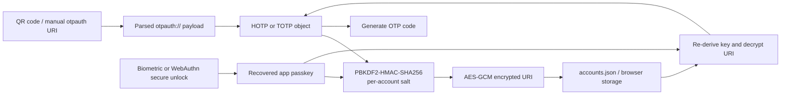

In my [previous post](https://arnav.tech/architecting-twofac-kotlin-multiplatform-module-structure), I talked about how TwoFac is structured as a Kotlin Multiplatform project. That post was about module boundaries. This one is about the thing that matters a lot more once you actually trust an authenticator app with your accounts: the cryptographic pipeline.

When you scan a QR code into TwoFac, we do **not** store "the current 6-digit code." We store the long-lived secret material that can deterministically produce every future code for that account, then we wrap that material behind encryption, platform secure unlock, or both.

That distinction is the whole game.

## The First Important Mental Model: TOTP Apps Do Not Invent Secrets

If you are used to thinking about 2FA from the login screen outward, it is easy to imagine the authenticator app as something that somehow *creates* a new secret every 30 seconds.

It does not.

What it actually has is a symmetric secret key that was provisioned once, almost always through an `otpauth://` URI embedded in a QR code. Every future OTP is just deterministic math over that secret plus a moving factor.

In TwoFac, the formulas reduce to this:

```text
HOTP(K, C) = Truncate(HMAC(K, C)) mod 10^digits
TOTP(K, t) = HOTP(K, floor((t - T0) / X))
```

Where:

* `K` is the shared secret from the QR code.
* `C` is an event counter for HOTP.
* `t` is the current Unix time.
* `T0` is the base time.
* `X` is the time step, usually 30 seconds.

That is the mental model I wanted the app to preserve all the way through the stack. The QR code is not just an onboarding artifact. It is the provisioning container for the actual secret.

## HOTP: HMAC with a Moving Counter

The core HOTP implementation in TwoFac lives in `sharedLib`, inside `HOTP.kt`. I kept it deliberately boring, because cryptographic code should usually be boring.

The implementation does exactly the RFC 4226-shaped thing:

* serialize the counter as an 8-byte big-endian value,
* Base32-decode the shared secret,
* compute HMAC over the counter using the selected hash,
* apply dynamic truncation,
* mask away the sign bit,
* take modulo `10^digits`,
* zero-pad the result.

The interesting bit is the dynamic truncation step. Instead of taking the first four bytes of the HMAC output, HOTP uses the low nibble of the final byte as an offset, then extracts four bytes from there. That is why the code in `HOTP.kt` looks slightly more annoying than a naive "`take(4)` and move on" implementation.

TwoFac supports:

* `SHA1`
* `SHA256`
* `SHA512`
* arbitrary digit widths at the algorithm layer

And because I do not trust crypto code that only "looks right," the shared tests include RFC vectors from both HOTP and TOTP. If an authenticator app cannot reproduce the RFC test vectors, it is not an authenticator app yet. It is a vibes-based number generator.

Also, one subtle detail: there is no Steam-style custom alphabet in this codepath. No base-26 five-character variant, no bespoke token format. In `sharedLib`, this is straight RFC-flavored OTP math.

## TOTP: Same Primitive, Different Moving Factor

TOTP in TwoFac is intentionally thin. It lives in `TOTP.kt`, and internally it just delegates to HOTP after converting time into a counter:

```text
counter = floor((currentTime - baseTime) / timeInterval)
```

By default, that means:

* `baseTime = 0`
* `timeInterval = 30`
* `digits = 6`
* `algorithm = SHA1`

But the implementation is not hard-coded to only that happy path. It can carry non-default digit counts, non-default periods, and alternate HMAC hashes all the way from provisioning to code generation.

Validation also accepts the previous and next time windows in addition to the current one. In other words, the verifier logic is effectively `T-1`, `T`, and `T+1`. That is the standard engineering compromise between "users have imperfect clocks" and "I do not want to widen the replay window too much."

There is one more small thing I like here: `TOTP.kt` exposes `nextCodeAt()`. That sounds cosmetic, but it is what lets the UI reason about the countdown instead of treating OTP generation as a pure black box.

## `otpauth://` Is the Provisioning Format That Actually Matters

So what is inside the QR code?

Almost always, some flavor of this:

```text
otpauth://totp/Example:alice@example.com?secret=JBSWY3DPEHPK3PXP&issuer=Example&algorithm=SHA1&digits=6&period=30
```

That string carries nearly everything the authenticator needs:

* the OTP type: `hotp` or `totp`
* the human-facing label
* the issuer
* the Base32 secret
* the HMAC algorithm
* the digit count
* the TOTP period, or the HOTP counter

In other words, the QR code is not a hint. It is provisioning data.

TwoFac parses and builds these URIs in `OtpAuthURI.kt`. The parser is strict in a few places that matter:

* the scheme must be `otpauth://`
* the type must be `totp` or `hotp`
* `secret` must exist
* if the label encodes an issuer prefix and the query string also contains `issuer`, they must match

That last rule is a small thing, but it is exactly the kind of small thing that saves you from annoying provider-specific ambiguity later.

On the way in, the QR pipeline in `composeApp` normalizes whitespace and canonicalizes the scheme before handing the payload to `OtpAuthURI.parse()`. On the way out, `OtpAuthURI.create()` turns an in-memory OTP object back into a provisionable URI.

This is also the right place to make a pedantic correction to a very common way of describing QR onboarding. The QR code is **not** a seed that generates future secrets. It already contains the long-lived secret. What it generates in the future are **codes**.

## What Actually Lands in `accounts.json`

Once the URI has been parsed, TwoFac does not persist it in plaintext on native platforms.

Instead, it turns each account into a `StoredAccount`:

```kotlin
data class StoredAccount(
    val accountID: Uuid,
    val accountLabel: String,
    val salt: String,
    val encryptedURI: String,
)
```

That shape is doing more work than it first appears to.

* `accountLabel` stays plaintext because the UI needs something human-readable to list.
* `salt` is the per-account KDF salt, hex-encoded.
* `encryptedURI` is the AES-GCM ciphertext of the original `otpauth://...` URI, also hex-encoded.

So the file is not "a JSON list of secrets." It is a JSON list of labels plus encrypted provisioning payloads.

The `accounts.json` file itself is created through `KStore`, which gives us one persistence API across Android, iOS, Desktop, and the CLI. On the web target, the same logical structure is persisted via browser storage rather than an actual filesystem path, but the data model is the same: store `StoredAccount`, not live OTP objects.

There is also a slightly weird detail here that I genuinely enjoy. `accountID` is derived directly from the random salt bytes via `Uuid.fromByteArray(...)`.

That is not the most common design in the world.

But it does mean every stored account already carries a stable identifier that is cryptographically adjacent to its encryption material without having to invent a second random ID source.

## The Passkey Is Not the Encryption Key

This is the second mental model that matters.

When you unlock TwoFac with your passkey, that passkey is **not** used directly as the AES key for the vault. Instead, it is fed through a KDF separately for each account.

The flow inside `DefaultCryptoTools.kt` and `StorageUtils.kt` looks like this:

```text
passkey
  + per-account random salt
    -> PBKDF2-HMAC-SHA256
      -> 256-bit derived key
        -> AES-GCM encrypt(otpauth URI)
          -> encryptedURI stored in accounts.json
```

That per-account salt matters more than people sometimes realize. It means two accounts protected by the same user passkey still do **not** end up with the same encryption key. TwoFac is not encrypting one giant blob with one giant static vault key; it is deriving a fresh key per stored account.

On read, we do the inverse:

* take the stored hex salt,
* re-derive the same 256-bit key from the user passkey,
* decrypt the hex ciphertext with AES-GCM,
* parse the recovered `otpauth://` URI back into a `HOTP` or `TOTP` object.

That is the moment when the provisioning payload becomes "live" again.

## Why AES-GCM Shows Up Everywhere

I wanted authenticated encryption here, not just encryption.

That is why the storage path uses AES-GCM instead of something older and more annoying to compose safely. AES-GCM gives us:

* confidentiality — the URI stays unreadable without the derived key,
* integrity/authentication — tampering with the ciphertext causes decryption to fail,
* a straightforward blob format where storing ciphertext and nonce-adjacent metadata is fine as long as the key remains protected.

This is the kind of property that is easy to under-appreciate in app code. If an attacker flips a few bits in `encryptedURI`, I do not want "garbled but maybe parseable secret." I want the decrypt step to fail loudly.

TwoFac gets those primitives through [`cryptography-kotlin`](https://github.com/whyoleg/cryptography-kotlin), which is one of the reasons I like having the crypto inside `sharedLib`. The algorithmic intent is shared, but the actual backend implementation still maps to native platform crypto providers instead of me trying to be clever with handwritten primitives.

## The Boring Constant That Matters More Than Most Fancy Diagrams

There is, however, one place where the current implementation is more "engineering prototype" than "finished security posture": PBKDF2 tuning.

Right now, the code derives keys with:

* PBKDF2-HMAC-SHA256
* 16-byte random salt
* 256-bit output key
* `HASH_ITERATIONS = 200`

Everything in that list except the final number looks fine.

That iteration count is too low. Dramatically too low. It is exactly the sort of placeholder constant that is easy to leave in during early development because the app feels snappy and the structure is otherwise correct.

It is also the sort of constant that a security-conscious reader should absolutely side-eye.

So the honest description is this: TwoFac already has the right *shape* here — passkey -> KDF -> per-account key -> AES-GCM — but the cost parameter still needs to be turned up aggressively before I would consider this layer fully hardened.

## What Biometrics Actually Protect on Mobile

When people say "the app is protected with biometrics," that phrase is usually too fuzzy to be useful.

In TwoFac, the biometric is not what decrypts `accounts.json` directly.

The biometric protects the **saved app passkey**.

That passkey is then used to derive the per-account keys that decrypt the stored `otpauth://` payloads. So the trust chain is:

```text
biometric gate
  -> unlock saved passkey
    -> derive per-account key with PBKDF2
      -> AES-GCM decrypt encryptedURI
        -> recover otpauth URI
          -> generate OTP
```

### Android: The Strong Version

On Android, this path is the one I wanted from the start.

`AndroidBiometricSessionManager.kt` creates an AES key inside the Android Keystore with:

* `setUserAuthenticationRequired(true)`
* `BIOMETRIC_STRONG`
* AES/GCM/NoPadding
* invalidation on biometric enrollment changes

That Keystore key then encrypts the saved passkey before it lands in `SharedPreferences`. Later, `BiometricPrompt` authenticates the user and authorizes the use of that Keystore key to decrypt the passkey.

So on Android, the biometric is protecting **key usage** in the platform keystore. The plaintext passkey is only recovered after the system biometric flow succeeds.

That is a materially stronger guarantee than "I showed a fingerprint prompt before reading some app-owned bytes."

### iOS: The UX Is Right, the Cryptographic Boundary Still Needs Hardening

On iOS, the current flow uses `LAContext` and `LocalAuthentication` to gate access to the saved passkey, which gives the user the right interaction model: Face ID or Touch ID before unlock.

But if we are being exact — and for a post like this, we should be exact — the current storage backend is still simpler than I want it to be. The implementation path is currently closer to "biometric-gated retrieval" than "passkey wrapped by a Keychain item with biometric access control."

In other words, the Android path is already genuinely keystore-backed. The iOS path still wants a stricter Keychain-backed binding to match that strength.

I would rather say that plainly than pretend all "biometric unlock" labels are cryptographically identical across platforms.

## WebAuthn on the PWA and Browser Extensions Is Doing Something Slightly Different

The web story is where things get really fun.

On the PWA and the browser extensions, TwoFac does **not** use WebAuthn as a remote login mechanism. There is no server-side account assertion flow here. Instead, WebAuthn is used as a **local secure unlock gate** for the app passkey.

That distinction matters because it changes what the credential is for.

The credential is not there to prove to my backend who you are. It is there to let the browser talk to a platform authenticator or a roaming FIDO key and recover enough cryptographic material to unwrap the locally stored passkey.

## The WebAuthn PRF Trick

The important piece is the WebAuthn PRF extension.

At enrollment time, `BrowserSessionManager.kt` does roughly this:

* create a WebAuthn credential,
* immediately perform an authentication ceremony for that credential,
* ask for PRF output,
* feed that PRF output into HKDF-SHA256,
* derive an AES-GCM key,
* encrypt the local app passkey,
* persist only the encrypted blob plus metadata.

At unlock time, it does the same authentication ceremony again and derives the same wrapping key again.

The chain looks like this:

```text
WebAuthn credential assertion
  -> PRF output
    -> HKDF-SHA256(context, salt)
      -> AES-GCM key
        -> decrypt saved app passkey
          -> unlock accounts.json entries
```

The TypeScript side in `webauthn.mts` and `crypto.mts` is very explicit about this.

* The PRF request uses an app-scoped salt (`"twofac"` in bytes).
* The HKDF context includes the credential ID, via a string like `twofac-passkey-v1:<credentialId>`.
* AES-GCM uses additional authenticated data bound to that same context string.

That is not accidental ceremony. It is domain separation. I want the wrapping key to be bound to **this** app-level use case and **this** credential, not just "some bytes we got back from a nice security API."

## What Gets Stored in the Browser

The browser does not store the plaintext passkey.

What it stores is:

* the enrolled WebAuthn credential ID,
* an encrypted blob containing:
  * HKDF salt
  * AES-GCM nonce
  * AES-GCM ciphertext
* secure-unlock preference metadata

So even though the storage backend is still browser-local storage, the secret that matters is wrapped under a key that only becomes reconstructable after a successful WebAuthn ceremony.

And this is exactly where fingerprint, Face ID, Windows Hello, or a YubiKey fits in.

They are not "decrypting `accounts.json`" themselves. They are satisfying the user-verification requirement for the WebAuthn credential, which then yields PRF output, which then derives the AES-GCM key that unwraps the saved passkey, which then unlocks the per-account encrypted URIs.

Yes, that is a lot of arrows.

That is also why I like it.

## The Whole Pipeline

At a high level, the full path inside TwoFac looks like this:



And this is really the thing I wanted from the architecture from day one: the same core OTP and storage logic living in `sharedLib`, with the platform-specific secure-unlock layers bolted on top in a way that still preserves one coherent mental model.

Android does it with Keystore-backed biometrics. The web does it with WebAuthn plus PRF plus HKDF plus AES-GCM. The native apps and CLI all converge on the same encrypted account representation once the passkey is available.

Different platform affordances. Same cryptographic spine.

## Why I Like This Design

I am not trying to invent a new OTP algorithm here. That would be a terrible hobby.

What I *am* trying to do is compose a small number of very boring, very well-understood primitives in a way that works across phones, desktops, browsers, extensions, watches, and the CLI without losing the plot.

That means:

* HOTP/TOTP from the RFCs,
* `otpauth://` as the provisioning contract,
* per-account KDF + AES-GCM for stored secrets,
* biometrics or WebAuthn for protecting the saved passkey,
* one shared library implementing the actual vault logic.

There are still a few edges I want to harden further — particularly around KDF cost tuning and making the iOS secure-storage boundary as strong as the Android one. But the structure itself is the part I care about most. Once the structure is right, hardening becomes a series of parameter upgrades and platform-specific improvements, not a rewrite.

And that, in security engineering, is usually the difference between a system that matures and a system that gets replaced.

***

### Links and References

* [TwoFac GitHub Repository](https://github.com/championswimmer/TwoFac)
* [RFC 4226: HOTP](https://datatracker.ietf.org/doc/html/rfc4226)
* [RFC 6238: TOTP](https://datatracker.ietf.org/doc/html/rfc6238)
* [Google Authenticator Key URI Format](https://github.com/google/google-authenticator/wiki/Key-Uri-Format)
* [W3C WebAuthn PRF Extension](https://www.w3.org/TR/webauthn-3/#prf-extension)
* [MDN: WebAuthn Extensions](https://developer.mozilla.org/en-US/docs/Web/API/Web_Authentication_API/WebAuthn_extensions#prf)
* [Android BiometricPrompt Guide](https://developer.android.com/identity/sign-in/biometric-auth)
* [cryptography-kotlin](https://github.com/whyoleg/cryptography-kotlin)
* [KStore](https://github.com/championswimmer/KStore)
