In the [previous article](https://arnav.tech/architecting-twofac-my-journey-into-kotlin-multiplatform-module-structure), I walked through how TwoFac is structured as a Kotlin Multiplatform project. With that groundwork out of the way, we can zoom in on one of the most important pieces in the shared core: OTP generation itself. When you open an authenticator app and watch a 6-digit code ticking down, it's easy to treat it as magic and move on. But there's some genuinely elegant cryptography behind that little countdown. In this post, I'm going to pop the hood on **TOTP** — Time-based One-Time Passwords — unpack the math, walk through the RFCs, and then show how we implement it in TwoFac.

> **Note:** This post focuses only on OTP generation — how we take a shared secret and turn it into those familiar 6-digit codes. How we *store* secrets securely (PBKDF2, AES-GCM, the `accounts.json` file) is a story for the next post.

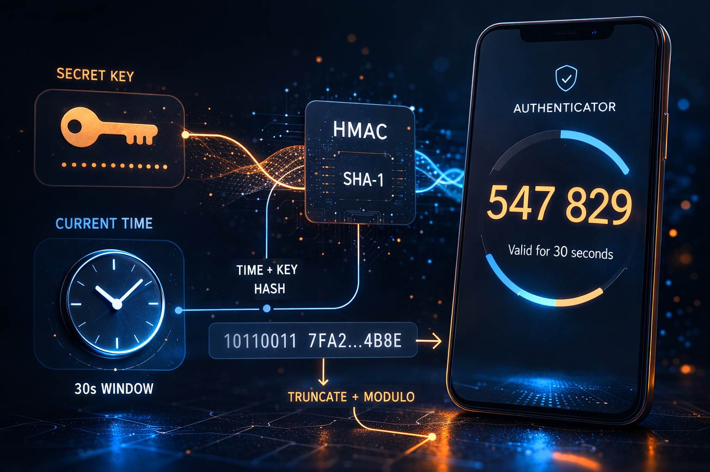

## Why Do We Even Need a "Second Factor"?

Passwords on their own are brittle. People reuse them, attackers phish them, data breaches leak them, and brute-force attacks are still very real. The whole point of two-factor authentication (2FA) is to pair **something you know** (your password) with **something you have** (your phone or authenticator app).

So even if an attacker gets your password, they still need physical access to your device to produce the current OTP. And since that OTP rotates every 30 seconds, a stolen code has a very short shelf life.

What makes TOTP-based 2FA especially nice is that it works **offline**. Your authenticator app doesn't have to call home to some server. The app and the server both compute the same code independently from a shared secret and the current time. No SMS, no push, no network dependency. Just math.

## Starting from the Foundation: HOTP

To understand TOTP properly, we first need HOTP — HMAC-based One-Time Password — defined in [RFC 4226](https://datatracker.ietf.org/doc/html/rfc4226).

At a high level, HOTP is simple. You take a **shared secret** and a **counter**, run them through HMAC, and then squeeze the result into a number a human can actually type.

### The HOTP Algorithm Step-by-Step

Here's the formula:

```
HOTP(K, C) = Truncate(HMAC-SHA1(K, C)) mod 10^d
```

Where:
- **K** = the shared secret key (a byte array)
- **C** = an 8-byte counter value (big-endian)
- **d** = the number of digits in the output (usually 6)

Let's walk through that one piece at a time.

#### Step 1: Counter to Bytes

The counter is a 64-bit integer, and the RFC wants it encoded as an 8-byte array in big-endian order. So if the counter is `5`, the bytes look like this:

```
[0x00, 0x00, 0x00, 0x00, 0x00, 0x00, 0x00, 0x05]
```

#### Step 2: HMAC-SHA1

Next we compute [HMAC](https://datatracker.ietf.org/doc/html/rfc2104), using the shared secret as the key and the counter bytes as the message. With SHA-1 underneath, that gives us a **20-byte** (160-bit) output.

Formally, HMAC is defined as:

```
HMAC(K, text) = H((K' ⊕ opad) || H((K' ⊕ ipad) || text))
```

Here, `ipad` is `0x36` repeated, `opad` is `0x5c` repeated, and `K'` is the key padded to the hash function's block size (64 bytes for SHA-1). If that formula looks a bit hostile, that's normal; in real code you let a crypto library handle it.

#### Step 3: Dynamic Truncation

This is the neat part. We have a 20-byte HMAC output, but what we actually want is a 6-digit code. RFC 4226 solves that with **dynamic truncation**:

1. Take the **last byte** of the HMAC and look at its lowest 4 bits. That gives you an **offset** (0–15).
2. Starting at that offset, grab **4 consecutive bytes**.
3. Mask off the most significant bit (to avoid sign issues), which leaves you with a **31-bit unsigned integer**.

```
offset = hmac[19] & 0x0F

code = ((hmac[offset]     & 0x7F) << 24)
     | ((hmac[offset + 1] & 0xFF) << 16)
     | ((hmac[offset + 2] & 0xFF) << 8)
     |  (hmac[offset + 3] & 0xFF)
```

#### Step 4: Modulo

From there, it's straightforward: take that 31-bit integer modulo `10^digits`, then pad with leading zeros if needed:

```
otp = code % 1000000  →  "038314"
```

### Visualizing the HOTP Flow

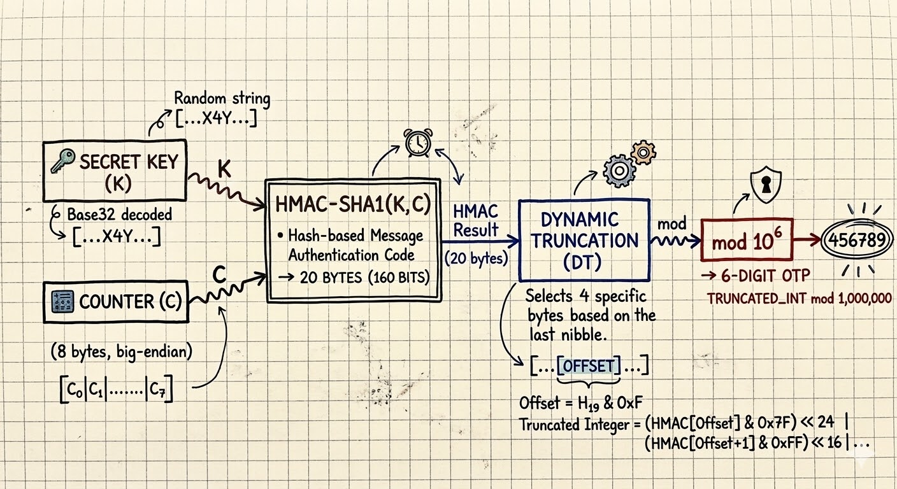

<details>
    <summary>Diagram: HOTP Flow</summary>

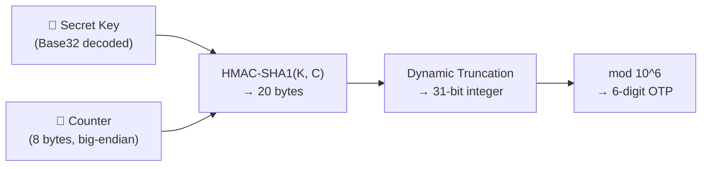

</details>


### HOTP's Limitation: The Counter Sync Problem

HOTP works, but it comes with an annoying operational problem: both the client and the server have to keep a synchronized counter. Every time you generate a code, that counter moves forward. If you generate a code and *don't* use it, your device advances but the server doesn't. Now the two sides disagree.

Servers usually paper over this with a "look-ahead window" — they'll try `C`, `C+1`, `C+2`, and so on up to some limit. That works, but it's a little fragile. And a stolen HOTP code stays valid until it's used or the counter moves past it.

TOTP exists to get rid of exactly this headache.

## Enter TOTP: Time as the Counter

**TOTP** ([RFC 6238](https://datatracker.ietf.org/doc/html/rfc6238)) is really just HOTP with one very good idea layered on top: instead of maintaining a counter, we **derive the counter from the current time**.

```
T = floor((CurrentUnixTime - T0) / TimeStep)
```

Where:
- **CurrentUnixTime** = seconds since the Unix epoch (1970-01-01 00:00:00 UTC)
- **T0** = the reference time (usually 0, i.e., the epoch itself)
- **TimeStep** = how often the code changes (usually **30 seconds**)

Once we have `T`, we just feed it into HOTP as the counter:

```
TOTP(K, T) = HOTP(K, T)
```

That's the whole trick. TOTP is basically "take HOTP, but make the counter come from time."

### Why 30 Seconds?

Thirty seconds is a compromise between security and usability. Shorter windows, like 10 seconds, are stricter but don't leave humans much time to read and type the code. Longer windows, like 60 seconds, are friendlier but give an attacker more time to reuse a stolen code. [RFC 6238](https://datatracker.ietf.org/doc/html/rfc6238) lands on 30 seconds because it's a pretty sensible middle ground.

### Clock Drift Tolerance

Real devices don't keep perfect time, so a bit of clock drift is expected. To account for that, servers usually accept OTPs from the **previous**, **current**, and **next** time windows — effectively a 90-second acceptance window. That's usually enough to absorb minor drift without giving up much security.

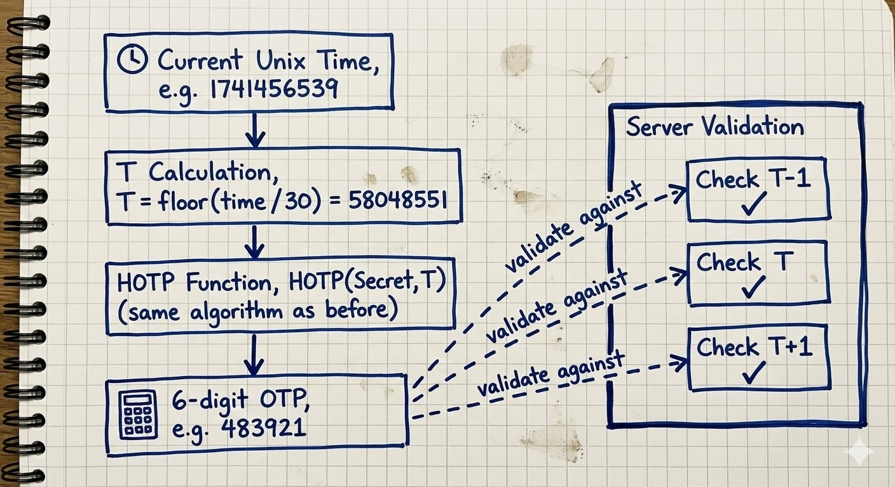

<details>
    <summary>Diagram: TOTP Drift Tolerance</summary>

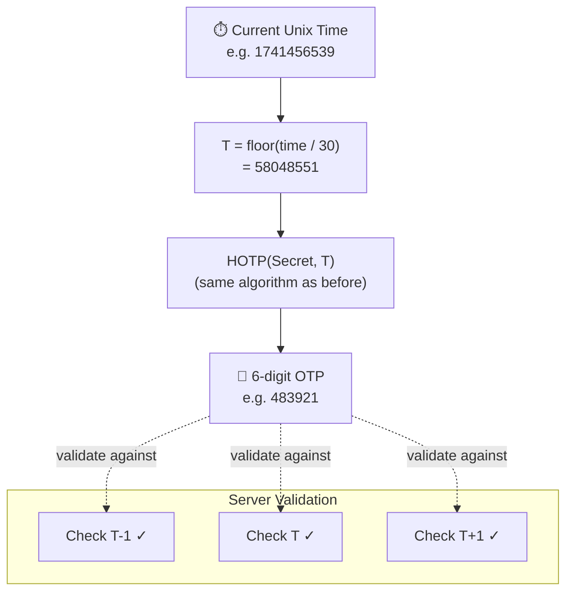
</details>

### TOTP Supports More Hash Algorithms

While HOTP (RFC 4226) was specified with SHA-1 only, TOTP (RFC 6238) explicitly supports:

| Algorithm   | HMAC Output | RFC 6238 Test Vectors |
|-------------|-------------|----------------------|
| HMAC-SHA1   | 20 bytes    | ✅ Yes               |
| HMAC-SHA256 | 32 bytes    | ✅ Yes               |
| HMAC-SHA512 | 64 bytes    | ✅ Yes               |

The nice part is that dynamic truncation doesn't really care how large the hash output is. It still uses the last byte to find the offset, and it still extracts 4 bytes. The possible offset range also doesn't change: 4 bits means 0–15 whether the HMAC output is 20 bytes (SHA-1), 32 bytes (SHA-256), or 64 bytes (SHA-512).

In practice, almost every service still uses SHA-1. A few more security-conscious services — some crypto exchanges are a common example — switch to SHA-256 or SHA-512 for the larger HMAC output.

## How TOTP Provisioning Works: QR Codes and `otpauth://` URIs

When you turn on 2FA on a website, the flow usually looks like this under the hood:

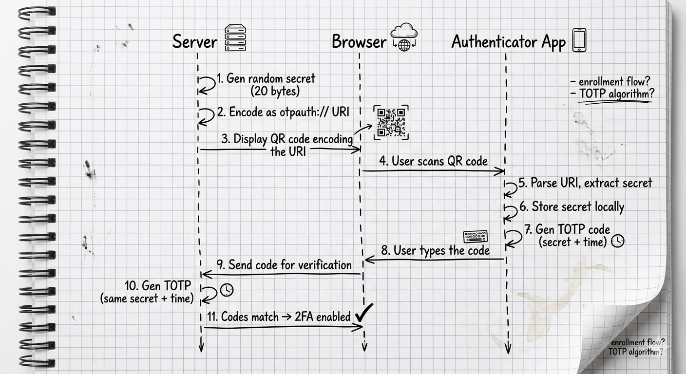

<details>
    <summary>Diagram: TOTP Registration Flow</summary>

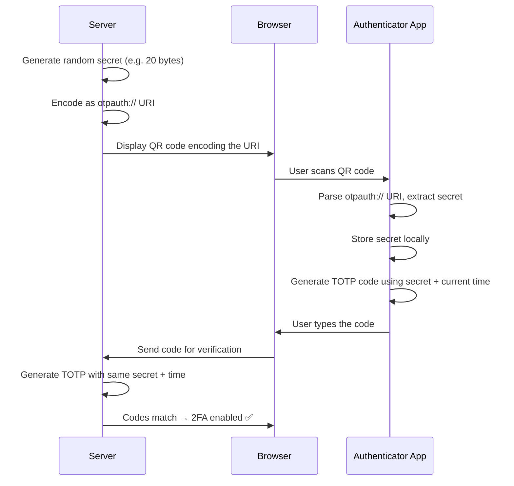

</details>

### Anatomy of an `otpauth://` URI

The QR code encodes a URI in the [`otpauth://` format](https://github.com/google/google-authenticator/wiki/Key-Uri-Format), formalized in the IETF draft [draft-linuxgemini-otpauth-uri](https://datatracker.ietf.org/doc/draft-linuxgemini-otpauth-uri/):

```
otpauth://totp/GitHub:alice@example.com?secret=JBSWY3DPEHPK3PXP&issuer=GitHub&algorithm=SHA1&digits=6&period=30
```

Here's what each piece is doing:

| Component      | Example                        | Description |
|----------------|-------------------------------|-------------|
| **Scheme**     | `otpauth://`                  | The URI scheme — tells the app this is an OTP credential |
| **Type**       | `totp`                        | Either `totp` or `hotp` |
| **Label**      | `GitHub:alice@example.com`    | The issuer and account, separated by `:` |
| **secret**     | `JBSWY3DPEHPK3PXP`           | The shared secret, [Base32](https://datatracker.ietf.org/doc/html/rfc4648)-encoded (no padding) |
| **issuer**     | `GitHub`                      | The service name (displayed in the app) |
| **algorithm**  | `SHA1`                        | Hash algorithm: `SHA1`, `SHA256`, or `SHA512` (default: SHA1) |
| **digits**     | `6`                           | Number of digits: 6 or 8 (default: 6) |
| **period**     | `30`                          | TOTP time step in seconds (default: 30) |
| **counter**    | *(HOTP only)*                 | Initial counter value for HOTP |

The `secret` parameter is the bit that really matters. It's the shared secret that both the server and your authenticator app use to independently generate matching codes. It's Base32-encoded because Base32 sticks to uppercase letters and digits 2–7, which makes it much less annoying to display and type by hand if QR scanning fails.

## How Do Other Authenticator Apps Store Secrets?

While researching this post, I went down a fun rabbit hole on how different authenticator apps store OTP secrets and backups. The range is **wild** — everything from "barely encrypted" to "actually pretty solid":

### Google Authenticator

Google Authenticator's history here is... not great. On Android, it originally stored secrets in a **plaintext SQLite database** with no encryption at all. If a device was rooted, anyone with access could read all the 2FA secrets directly. When Google added cloud sync in 2023, it [initially transferred secrets without end-to-end encryption](https://www.androidauthority.com/google-authenticator-e2e-encryption-3317498/), which meant Google's servers could theoretically read them. They later [added E2EE to cloud sync](https://security.googleblog.com/2023/04/google-authenticator-now-supports.html), but local storage on Android still depends on OS-level sandboxing rather than app-level encryption.

### Microsoft Authenticator

Microsoft Authenticator is more serious about this stuff. On iOS, secrets live in the [Keychain](https://developer.apple.com/documentation/security/keychain-services), and on Android they use [encrypted shared preferences](https://developer.android.com/reference/androidx/security/crypto/EncryptedSharedPreferences). Cloud backups are encrypted too: iCloud backups inherit Keychain protection, and Android backups go to Microsoft's servers with account-based encryption.

### Authy (Twilio)

Authy was one of the first authenticator apps to offer cloud backup. Before upload, it encrypted secrets with a user-provided "backups password" (run through [PBKDF2](https://datatracker.ietf.org/doc/html/rfc2898) or a similar KDF). The downside is that the app was proprietary and [was sunset in 2024](https://www.twilio.com/docs/authy), with users told to migrate away. Also in 2024, Twilio [disclosed a breach](https://techcrunch.com/2024/07/03/twilio-says-hackers-identified-cell-phone-numbers-of-two-factor-app-authy-users/) where phone numbers tied to Authy accounts were leaked, though not the secrets themselves.

### 1Password & Bitwarden

Both 1Password and Bitwarden treat TOTP secrets as just another field inside the encrypted vault. They use [AES-256-GCM](https://csrc.nist.gov/publications/detail/sp/800-38d/final), with keys derived from your master password via [PBKDF2](https://datatracker.ietf.org/doc/html/rfc2898) in Bitwarden and [Argon2](https://www.rfc-editor.org/rfc/rfc9106.html) in 1Password. So the OTP secret ends up protected the same way the rest of your vault item is. Both have also been [independently audited](https://bitwarden.com/help/is-bitwarden-audited/) and are open-source to varying degrees (Bitwarden fully, 1Password's crypto components partially).

### 2FAS

[2FAS](https://2fas.com/) is fully open-source and keeps secrets encrypted on-device. It uses a user-provided password to derive the encryption key. Backups are encrypted files that you control yourself, with no mandatory cloud component. Their [source code is available on GitHub](https://github.com/twofas), which is a big win for auditability.

### Ente Auth

[Ente Auth](https://ente.io/auth/) is another strong open-source option. Their cloud sync uses end-to-end encryption with [XChaCha20-Poly1305](https://doc.libsodium.org/secret-key_cryptography/aead/chacha20-poly1305/xchacha20-poly1305_construction), and the keys come from the user's password via Argon2. Their code is [fully open-source](https://github.com/ente-io/ente) and has been independently audited.

### Summary Table

| App                  | Encryption at Rest | Cloud Backup    | Backup Encryption | Open Source |
|----------------------|-------------------|-----------------|-------------------|-------------|
| Google Authenticator | OS sandbox only   | Optional (Google)| E2EE (added later)| ❌          |
| Microsoft Authenticator | Keychain / EncryptedPrefs | iCloud/Microsoft | Account-based | ❌ |
| Authy                | Encrypted         | Yes (Twilio)    | Password-based    | ❌          |
| 1Password            | AES-256-GCM       | Yes (1Password) | Master password   | Partial     |
| Bitwarden            | AES-256-GCM       | Yes (Bitwarden) | Master password   | ✅          |
| 2FAS                 | Encrypted         | Optional (file) | Password-based    | ✅          |
| Ente Auth            | XChaCha20-Poly1305| Yes (Ente)      | E2EE (Argon2)     | ✅          |
| **TwoFac**           | AES-256-GCM       | Optional (file) | Password-based (PBKDF2) | ✅    |

## Diving Into Our Codebase

With the theory out of the way, let's look at how TwoFac actually wires this up. All of the OTP logic lives in our [`sharedLib`](https://github.com/championswimmer/TwoFac/tree/main/sharedLib) module — the pure Kotlin Multiplatform library shared by every platform we target (Android, iOS, Desktop, Web, CLI, and Wear OS).

### The Crypto Layer: `cryptography-kotlin`

We use [cryptography-kotlin](https://github.com/whyoleg/cryptography-kotlin) by [whyoleg](https://github.com/whyoleg) — specifically `dev.whyoleg.cryptography` v0.5.0 — for all of our cryptographic primitives. What I like about this library is that it wraps **platform-native** crypto providers instead of trying to reinvent them:

| Platform       | Crypto Provider |
|---------------|-----------------|
| JVM (Android, Desktop, Wear OS) | JDK (`java.security` / `javax.crypto`) |
| Native (iOS, macOS, Linux CLI) | OpenSSL 3 |
| Web (Wasm)    | [Web Crypto API](https://developer.mozilla.org/en-US/docs/Web/API/Web_Crypto_API) |

So we're not shipping some homegrown crypto implementation. On each platform, we delegate to the **battle-tested, OS-level crypto** that's already available there. Here's what that dependency setup looks like in [`sharedLib/build.gradle.kts`](https://github.com/championswimmer/TwoFac/tree/main/sharedLib/build.gradle.kts):

```kotlin
// commonMain
implementation(libs.crypto.kt.core)       // Core API

// jvmMain
implementation(libs.crypto.kt.jdk)        // → java.security / javax.crypto

// nativeMain (iOS, macOS, Linux)
implementation(libs.crypto.kt.openssl)    // → OpenSSL 3

// wasmJsMain (Web, Browser Extension)
implementation(libs.crypto.kt.web)        // → Web Crypto API
```

### The CryptoTools Interface

All of the cryptographic operations sit behind a [`CryptoTools`](https://github.com/championswimmer/TwoFac/tree/main/sharedLib/src/commonMain/kotlin/tech/arnav/twofac/lib/crypto/CryptoTools.kt) interface:

```kotlin
interface CryptoTools {
    enum class Algo { SHA1, SHA256, SHA512 }

    suspend fun hmacSha(algorithm: Algo, key: ByteString, data: ByteString): ByteString
    suspend fun createSigningKey(passKey: String, salt: ByteString? = null): SigningKey
    suspend fun encrypt(key: ByteString, secret: ByteString): ByteString
    suspend fun decrypt(encryptedData: ByteString, key: ByteString): ByteString
}
```

Notice that everything is a `suspend fun`. That's not just Kotlin style for the sake of style. On some platforms — WebCrypto being the obvious one — cryptographic operations are **inherently asynchronous**. Making the interface suspend-based lets us use those native async APIs cleanly without blocking.

The [`DefaultCryptoTools`](https://github.com/championswimmer/TwoFac/tree/main/sharedLib/src/commonMain/kotlin/tech/arnav/twofac/lib/crypto/DefaultCryptoTools.kt) implementation then hooks that interface up to `cryptography-kotlin`:

```kotlin
class DefaultCryptoTools(val cryptoProvider: CryptographyProvider) : CryptoTools {

    val hmac = cryptoProvider.get(HMAC)

    override suspend fun hmacSha(
        algorithm: CryptoTools.Algo,
        key: ByteString,
        data: ByteString
    ): ByteString {
        val keyDecoder = when (algorithm) {
            CryptoTools.Algo.SHA1 -> hmac.keyDecoder(SHA1)
            CryptoTools.Algo.SHA256 -> hmac.keyDecoder(SHA256)
            CryptoTools.Algo.SHA512 -> hmac.keyDecoder(SHA512)
        }
        val hmacKey = keyDecoder.decodeFromByteString(HMAC.Key.Format.RAW, key)
        val signature = hmacKey.signatureGenerator().generateSignature(data.toByteArray())
        return ByteString(signature)
    }
}
```

### The OTP Interface

Both HOTP and TOTP implement a shared [`OTP`](https://github.com/championswimmer/TwoFac/tree/main/sharedLib/src/commonMain/kotlin/tech/arnav/twofac/lib/otp/OTP.kt) interface:

```kotlin
interface OTP {
    val digits: Int                      // 6 or 8
    val algorithm: CryptoTools.Algo      // SHA1, SHA256, SHA512
    val secret: String                   // Base32-encoded
    val accountName: String              // e.g. "alice@example.com"
    val issuer: String?                  // e.g. "GitHub"

    suspend fun generateOTP(counter: Long): String
    suspend fun validateOTP(otp: String, counter: Long): Boolean
}
```

### Our HOTP Implementation

The [`HOTP`](https://github.com/championswimmer/TwoFac/tree/main/sharedLib/src/commonMain/kotlin/tech/arnav/twofac/lib/otp/HOTP.kt) class is, for the most part, a straight RFC 4226 implementation:

```kotlin
class HOTP(
    override val digits: Int = 6,
    override val algorithm: CryptoTools.Algo = CryptoTools.Algo.SHA1,
    override val secret: String,
    override val accountName: String,
    override val issuer: String?,
) : OTP {

    private val cryptoTools = DefaultCryptoTools(CryptographyProvider.Default)

    override suspend fun generateOTP(counter: Long): String {
        // 1. Counter → 8 bytes (big-endian)
        val counterBytes = ByteArray(8) { i ->
            ((counter shr ((7 - i) * 8)) and 0xFF).toByte()
        }

        // 2. Decode the Base32 secret
        val secretBytes = Encoding.decodeBase32(secret)

        // 3. HMAC
        val hmac = cryptoTools.hmacSha(
            algorithm,
            ByteString(secretBytes),
            ByteString(counterBytes)
        )

        // 4. Dynamic Truncation
        val fourBytes = dynamicTruncate(hmac)

        // 5. Modulo → pad with zeros
        val otp = fourBytes % 10.0.pow(digits.toDouble()).toInt()
        return otp.toString().padStart(digits, '0')
    }
}
```

The dynamic truncation helper mirrors the RFC directly:

```kotlin
internal fun dynamicTruncate(hmac: ByteString): Int {
    // Last byte's lowest 4 bits = offset (0-15)
    val offset = (hmac.get(hmac.size - 1) and 0x0F).toInt()

    // Extract 4 bytes, mask the MSB for a 31-bit unsigned int
    return ((hmac.get(offset).toInt() and 0x7F) shl 24) or
           ((hmac.get(offset + 1).toInt() and 0xFF) shl 16) or
           ((hmac.get(offset + 2).toInt() and 0xFF) shl 8) or
            (hmac.get(offset + 3).toInt() and 0xFF)
}
```

One detail worth calling out: our `dynamicTruncate` uses `hmac.size - 1` instead of hardcoding `19` the way many SHA-1-only examples do. That small choice is what makes the same implementation work correctly for SHA-256 (32 bytes) and SHA-512 (64 bytes) as well.

### Our TOTP Implementation

The [`TOTP`](https://github.com/championswimmer/TwoFac/tree/main/sharedLib/src/commonMain/kotlin/tech/arnav/twofac/lib/otp/TOTP.kt) class ends up being refreshingly small because it mostly wraps HOTP:

```kotlin
class TOTP(
    override val digits: Int = 6,
    override val algorithm: CryptoTools.Algo = CryptoTools.Algo.SHA1,
    override val secret: String,
    override val accountName: String,
    override val issuer: String?,
    private val baseTime: Long = 0,    // Unix epoch
    val timeInterval: Long = 30        // 30 seconds
) : OTP {

    // Reuse HOTP internally!
    private val hotp = HOTP(digits, algorithm, secret, accountName, issuer)

    private fun timeToCounter(currentTime: Long): Long {
        return (currentTime - baseTime) / timeInterval
    }

    override suspend fun generateOTP(currentTime: Long): String {
        val counter = timeToCounter(currentTime)
        return hotp.generateOTP(counter)
    }

    override suspend fun validateOTP(otp: String, currentTime: Long): Boolean {
        val counter = timeToCounter(currentTime)
        // Check previous, current, and next windows (±1)
        return hotp.validateOTP(otp, counter - 1) ||
               hotp.validateOTP(otp, counter) ||
               hotp.validateOTP(otp, counter + 1)
    }
}
```

This is one of my favorite bits of the codebase. `TOTP` doesn't reimplement any crypto logic; it just turns time into a counter and hands the real work to `HOTP`. The `validateOTP` method then checks the ±1 time windows, which is the standard tolerance for clock drift.

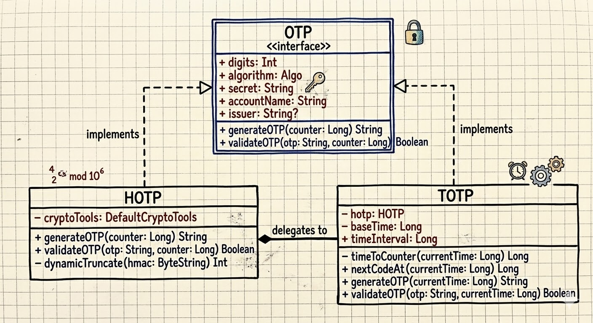

<details>
    <summary>Diagram: TOTP and HOTP Class Structure</summary>

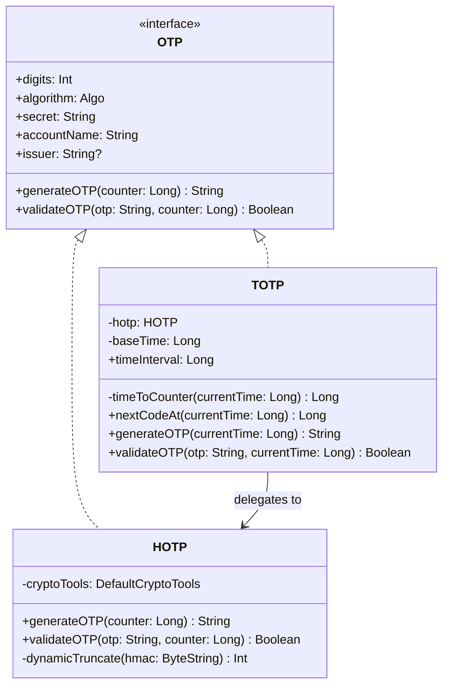

</details>

### Parsing `otpauth://` URIs

When you scan a QR code, the app needs to parse the `otpauth://` URI and instantiate the right OTP object. That's what [`OtpAuthURI`](https://github.com/championswimmer/TwoFac/tree/main/sharedLib/src/commonMain/kotlin/tech/arnav/twofac/lib/uri/OtpAuthURI.kt) does:

```kotlin
object OtpAuthURI {
    fun parse(uri: String): OTP {
        require(uri.startsWith("otpauth://"))

        // Extract type: "totp" or "hotp"
        val typeStr = uri.substring(10, uri.indexOf("/", 10))

        // Extract label: "GitHub:alice@example.com"
        val label = uri.substring(uri.indexOf("/", 10) + 1, uri.indexOf("?"))
        val labelIssuer = label.substringBefore(":", "")
        val accountName = label.substringAfter(":", label).trim()

        // Parse query parameters
        val params = paramsStr.split("&").associate { /* ... */ }

        val secret = params["secret"]!!
        val algorithm = when (params["algorithm"]?.uppercase()) {
            "SHA256" -> CryptoTools.Algo.SHA256
            "SHA512" -> CryptoTools.Algo.SHA512
            else -> CryptoTools.Algo.SHA1  // Default
        }

        return when (type) {
            Type.TOTP -> TOTP(
                digits = params["digits"]?.toIntOrNull() ?: 6,
                algorithm = algorithm,
                secret = secret,
                timeInterval = params["period"]?.toLongOrNull() ?: 30L,
                accountName = accountName,
                issuer = issuer
            )
            Type.HOTP -> HOTP(/* ... */)
        }
    }
}
```

The parser also has a `Builder` that does the reverse job: given an `OTP` object, it reconstructs the `otpauth://` URI. We use that path when exporting or backing up accounts.

### Base32 Encoding

OTP secrets inside the `otpauth://` URI are Base32-encoded per [RFC 4648](https://datatracker.ietf.org/doc/html/rfc4648). We have our own Base32 encoder/decoder in [`Encoding.kt`](https://github.com/championswimmer/TwoFac/tree/main/sharedLib/src/commonMain/kotlin/tech/arnav/twofac/lib/crypto/Encoding.kt):

```kotlin
object Encoding {
    const val ALPHABET = "ABCDEFGHIJKLMNOPQRSTUVWXYZ234567"

    fun decodeBase32(base32: String): ByteArray {
        val cleanInput = base32.replace("=", "").uppercase()
        // Each Base32 character represents 5 bits
        // We accumulate bits in a buffer and emit bytes when we have 8+
        var buffer = 0
        var bitsLeft = 0
        /* ... */
    }
}
```

Why Base32 and not Base64? Because Base32 stays in uppercase letters and digits 2–7, so you avoid messy visual ambiguity like `0`/`O`, `1`/`l`/`I`, and you also avoid symbols like `+` and `/`. That matters when a user has to type the secret manually because QR scanning failed.

### How We Store OTP Accounts

Each OTP account is persisted as a [`StoredAccount`](https://github.com/championswimmer/TwoFac/tree/main/sharedLib/src/commonMain/kotlin/tech/arnav/twofac/lib/storage/StoredAccount.kt):

```kotlin
@Serializable
data class StoredAccount(
    val accountID: Uuid,          // Unique identifier
    val accountLabel: String,     // Display name (e.g. "GitHub - alice")
    val salt: String,             // Salt for key derivation
    val encryptedURI: String,     // The otpauth:// URI, encrypted with AES-GCM
)
```

The key thing to notice is that we store the **encrypted** `otpauth://` URI, not the raw secret. That entire URI — including the secret, algorithm, issuer, and other metadata — is encrypted with AES-256-GCM using a key derived from the user's password via PBKDF2. Each account gets its own salt.

So even if someone gets hold of the storage file, they still can't read the OTP secrets without the user's password. The details of that pipeline deserve their own post, though, so we'll get into PBKDF2, AES-GCM, and the `accounts.json` format next time.

## Verifying Against the RFCs

One thing I'm particularly happy with is that the test suite validates against the **official RFC test vectors**. Here's a snippet from our [HOTP tests](https://github.com/championswimmer/TwoFac/tree/main/sharedLib/src/commonTest/kotlin/tech/arnav/twofac/lib/otp/HOTPTest.kt):

```kotlin
// Secret: "12345678901234567890" (ASCII)
// Base32: "GEZDGNBVGY3TQOJQGEZDGNBVGY3TQOJQ"
val expectedOTPs = listOf(
    "755224", // Counter = 0
    "287082", // Counter = 1
    "359152", // Counter = 2
    "969429", // Counter = 3
    "338314", // Counter = 4
    "254676", // Counter = 5
    "287922", // Counter = 6
    "162583", // Counter = 7
    "399871", // Counter = 8
    "520489"  // Counter = 9
)
```

Those are the exact test vectors from [RFC 4226 Appendix D](https://datatracker.ietf.org/doc/html/rfc4226#appendix-D). Our [TOTP tests](https://github.com/championswimmer/TwoFac/tree/main/sharedLib/src/commonTest/kotlin/tech/arnav/twofac/lib/otp/TOTPTest.kt) go a step further and validate against [RFC 6238's test vectors](https://datatracker.ietf.org/doc/html/rfc6238#appendix-B) for all three hash algorithms:

```kotlin
// RFC 6238 test vectors with 8-digit codes
RFC6238TestVector(59, "1970-01-01 00:00:59", key_sha1, SHA1, "94287082"),
RFC6238TestVector(59, "1970-01-01 00:00:59", key_sha256, SHA256, "46119246"),
RFC6238TestVector(59, "1970-01-01 00:00:59", key_sha512, SHA512, "90693936"),
// ... and more timestamps across decades
```

If the implementation matches the RFC test vectors on every platform we support (JVM, Native, and Wasm), we can be pretty confident we're computing OTPs correctly.

## The Full Picture

Here's the end-to-end picture in TwoFac, from scanning a QR code all the way to showing the 6-digit code on screen:

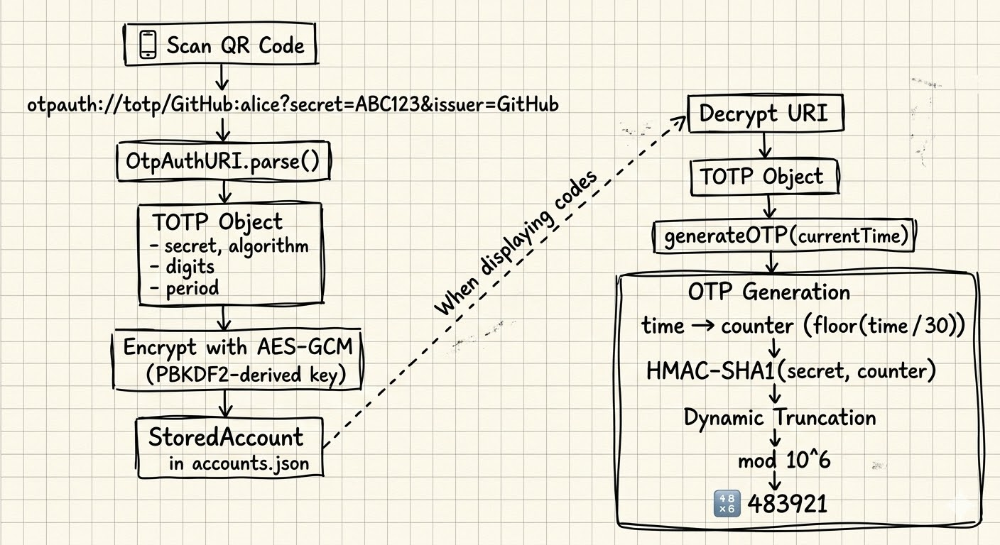

<details>
    <summary>Diagram: TwoFac End-to-End Flow</summary>

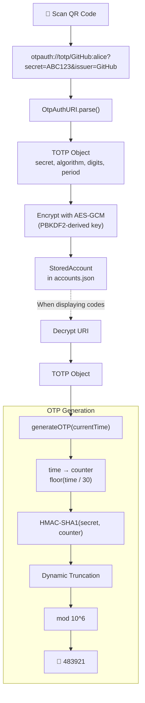

</details>

## What's Next?

In this post, we focused on the *generation* side of the problem — how a shared secret and the current time turn into those familiar 6-digit codes. But that's only half of the story.

In the next post, we'll switch to the *storage* side: how TwoFac protects secrets at rest with **PBKDF2** for key derivation and **AES-256-GCM** for authenticated encryption. We'll walk through the `accounts.json` format, why we picked the iteration counts we did, and how the encryption pipeline works across all platforms.

***

### Links and References

*   [TwoFac GitHub Repository](https://github.com/championswimmer/TwoFac)
*   [RFC 4226 — HOTP: An HMAC-Based One-Time Password Algorithm](https://datatracker.ietf.org/doc/html/rfc4226)
*   [RFC 6238 — TOTP: Time-Based One-Time Password Algorithm](https://datatracker.ietf.org/doc/html/rfc6238)
*   [RFC 2104 — HMAC: Keyed-Hashing for Message Authentication](https://datatracker.ietf.org/doc/html/rfc2104)
*   [RFC 4648 — Base Encodings (Base32)](https://datatracker.ietf.org/doc/html/rfc4648)
*   [draft-linuxgemini-otpauth-uri — The otpauth URI Format](https://datatracker.ietf.org/doc/draft-linuxgemini-otpauth-uri/)
*   [Google Authenticator Key URI Format](https://github.com/google/google-authenticator/wiki/Key-Uri-Format)
*   [cryptography-kotlin by whyoleg](https://github.com/whyoleg/cryptography-kotlin)
*   [NIST SP 800-38D — AES-GCM](https://csrc.nist.gov/publications/detail/sp/800-38d/final)
