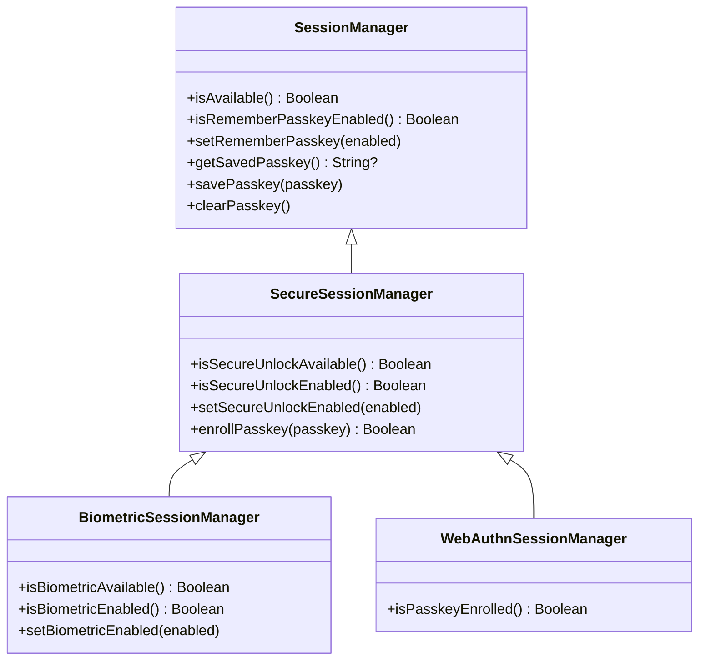
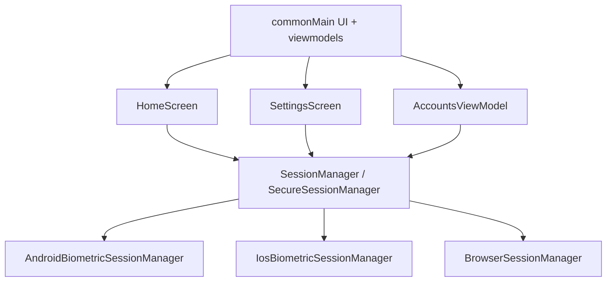
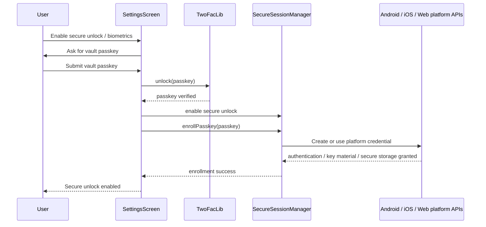
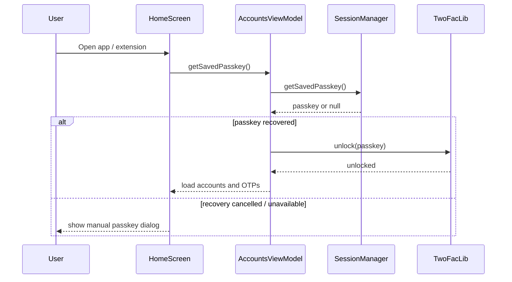
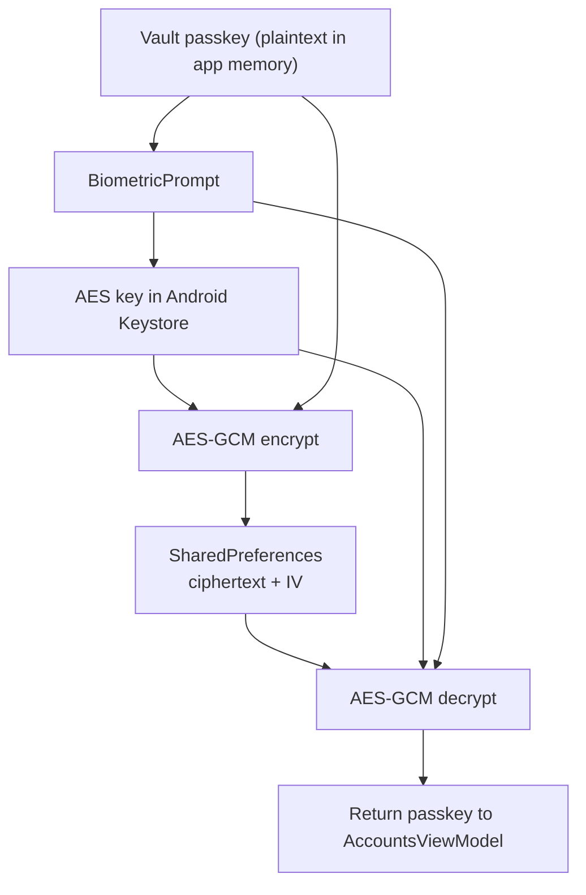
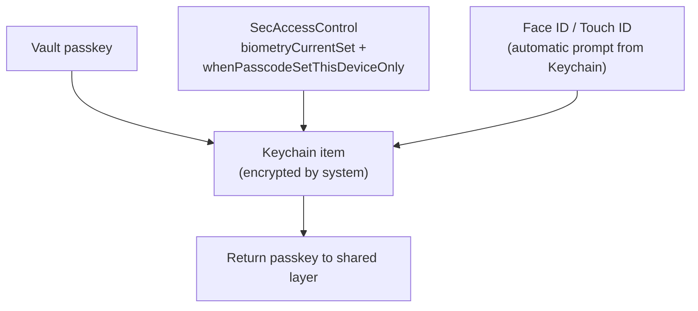
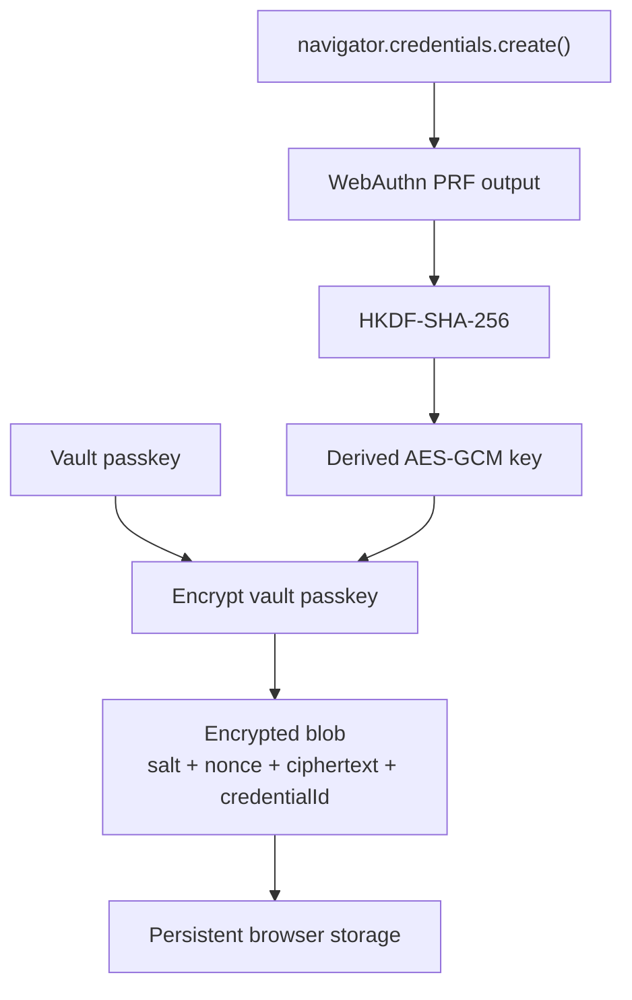
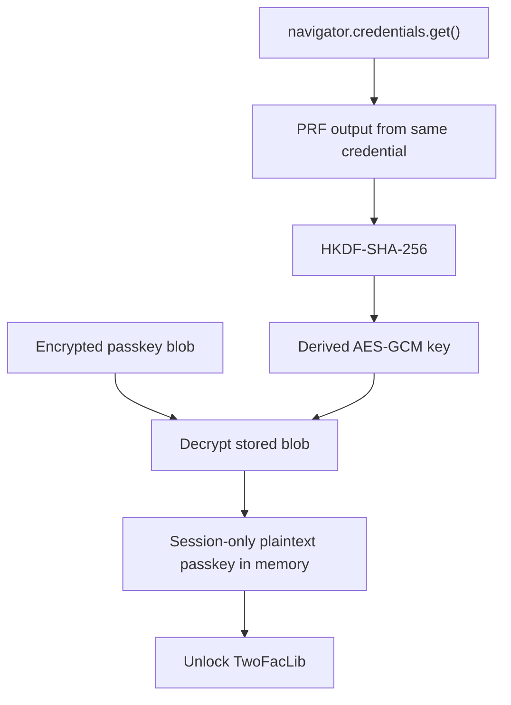

In the [previous post](https://arnav.tech/under-the-hood-how-totp-works-and-how-twofac-generates-your-2fa-codes), I focused on how TwoFac generates OTPs once it already has the secret material it needs. But that naturally leads to the next question: **how do we unlock that secret material safely without asking the user to type their vault passkey every single time?**

This post is about that layer: **secure session management**.

In TwoFac, the user still has a normal alphanumeric vault passkey that protects the encrypted account store. The secure-session layer does **not** replace that passkey. Instead, it decides whether the passkey can be:

1. remembered at all,
2. stored in a platform-protected way, and
3. recovered only after device verification such as biometrics or a platform passkey / hardware authenticator.

That distinction matters, especially on the web, where the word **passkey** can mean a WebAuthn/FIDO credential rather than the user’s own vault-unlock string.

> In this article, I’ll call the user-entered alphanumeric secret the **vault passkey**, and I’ll call WebAuthn / biometric device credentials the **platform credential**.

## The Core Abstractions: `SessionManager` and `SecureSessionManager`

The secure-session story starts in `composeApp/commonMain`, where the app defines platform-agnostic contracts:

- [`SessionManager.kt`](https://github.com/championswimmer/TwoFac/blob/main/composeApp/src/commonMain/kotlin/tech/arnav/twofac/session/SessionManager.kt)
- [`SecureSessionManager.kt`](https://github.com/championswimmer/TwoFac/blob/main/composeApp/src/commonMain/kotlin/tech/arnav/twofac/session/SecureSessionManager.kt)
- [`BiometricSessionManager.kt`](https://github.com/championswimmer/TwoFac/blob/main/composeApp/src/commonMain/kotlin/tech/arnav/twofac/session/BiometricSessionManager.kt)
- [`WebAuthnSessionManager.kt`](https://github.com/championswimmer/TwoFac/blob/main/composeApp/src/commonMain/kotlin/tech/arnav/twofac/session/WebAuthnSessionManager.kt)

At a high level:

| Contract | Responsibility |
| --- | --- |
| `SessionManager` | Generic “remember / retrieve / clear the vault passkey” contract |
| `SecureSessionManager` | Adds “is secure unlock available?” and “enroll the passkey into protected storage” |
| `BiometricSessionManager` | Secure unlock driven by mobile biometrics |
| `WebAuthnSessionManager` | Secure unlock driven by a WebAuthn credential |

Here is the type hierarchy:

This is a nice KMP design choice: the shared UI doesn’t have to know whether the secure unlock mechanism is backed by Android Keystore, Apple Keychain, or WebAuthn. It just talks to the contract.

## Where the Session Manager Gets Used

The runtime wiring happens through Koin modules:

- Android: [`AndroidModules.kt`](https://github.com/championswimmer/TwoFac/blob/main/composeApp/src/androidMain/kotlin/tech/arnav/twofac/di/AndroidModules.kt)
- iOS: [`IosModules.kt`](https://github.com/championswimmer/TwoFac/blob/main/composeApp/src/iosMain/kotlin/tech/arnav/twofac/di/IosModules.kt)
- Web/Wasm: [`WasmModules.kt`](https://github.com/championswimmer/TwoFac/blob/main/composeApp/src/wasmJsMain/kotlin/tech/arnav/twofac/di/WasmModules.kt)

Each platform binds a concrete implementation to the shared `SessionManager` interface:

And those shared callers are:

- [`SettingsScreen.kt`](https://github.com/championswimmer/TwoFac/blob/main/composeApp/src/commonMain/kotlin/tech/arnav/twofac/screens/SettingsScreen.kt), where the user enables “Remember Passkey”, “Biometric Unlock”, or “Secure Unlock”
- [`HomeScreen.kt`](https://github.com/championswimmer/TwoFac/blob/main/composeApp/src/commonMain/kotlin/tech/arnav/twofac/screens/HomeScreen.kt), where the app tries auto-unlock
- [`AccountsViewModel.kt`](https://github.com/championswimmer/TwoFac/blob/main/composeApp/src/commonMain/kotlin/tech/arnav/twofac/viewmodels/AccountsViewModel.kt), which asks for the saved passkey and persists it after successful unlock

## The End-to-End Flow

There are really two important flows:

1. **Enrollment**: user opts into secure unlock and the platform stores the vault passkey in a protected form.
2. **Unlock**: app starts, asks the platform manager for the saved passkey, and uses it to unlock `TwoFacLib`.

### Enrollment Flow

### Auto-Unlock Flow

That fallback behavior is deliberate. Secure unlock is a convenience feature, not the only way in.

## Android: AES-GCM + Android Keystore + `BiometricPrompt`

The Android implementation lives in [`AndroidBiometricSessionManager.kt`](https://github.com/championswimmer/TwoFac/blob/main/composeApp/src/androidMain/kotlin/tech/arnav/twofac/session/AndroidBiometricSessionManager.kt).

This is the strongest of the current native mobile implementations because it genuinely uses the Android platform’s secure key APIs:

- `AndroidKeyStore`
- `KeyGenParameterSpec`
- `BiometricPrompt`
- AES/GCM encryption
- a key marked with `setUserAuthenticationRequired(true)`
- `setInvalidatedByBiometricEnrollment(true)`

### How the Android Implementation Works

1. TwoFac creates or reuses an AES key inside **Android Keystore** under the alias `twofac_biometric_key`.
2. That key is configured so it can only be used after strong biometric authentication.
3. During enrollment, the app shows a `BiometricPrompt`.
4. After successful authentication, the app encrypts the **vault passkey** with AES-GCM.
5. The ciphertext and IV are stored in `SharedPreferences`.
6. On unlock, the app shows another biometric prompt, uses the keystore key to decrypt the ciphertext, and returns the plaintext passkey to the shared layer.

That looks like this:

### Why This Is a Good Pattern on Android

This is closely aligned with Android’s own security guidance:

- The [Android Keystore system](https://developer.android.com/privacy-and-security/keystore) exists so keys can remain device-bound and, where available, hardware-backed.
- Android’s [cryptography guidance](https://developer.android.com/privacy-and-security/cryptography) recommends authenticated encryption modes like AES-GCM for local secret protection.
- `BiometricPrompt` is Android’s standard user-verification API for strong biometric flows.
- [`setInvalidatedByBiometricEnrollment(true)`](https://developer.android.com/reference/android/security/keystore/KeyGenParameterSpec.Builder#setInvalidatedByBiometricEnrollment(boolean)) ensures that if device biometrics change, the previously enrolled key can be invalidated.

So on Android, TwoFac is doing the classic pattern correctly:

> store the **data** in app storage, but store the **key** in platform secure storage, and require biometric authentication before the key is usable.

That is much better than storing the plaintext passkey directly in preferences.

## iOS: Keychain + SecAccessControl + Face ID / Touch ID

The iOS implementation lives in [`IosBiometricSessionManager.kt`](https://github.com/championswimmer/TwoFac/blob/main/composeApp/src/iosMain/kotlin/tech/arnav/twofac/session/IosBiometricSessionManager.kt).

This implementation follows Apple’s recommended pattern for storing secrets with biometric protection:

- [Keychain Services](https://developer.apple.com/documentation/security/keychain-services) for encrypted secret storage,
- [`SecAccessControlCreateWithFlags`](https://developer.apple.com/documentation/security/secaccesscontrolcreatewithflags(_:_:_:_:)) with `kSecAccessControlBiometryCurrentSet` to require the currently enrolled biometrics,
- `kSecAttrAccessibleWhenPasscodeSetThisDeviceOnly` so the item is device-bound and requires a device passcode,
- Automatic Face ID / Touch ID prompts via `SecItemCopyMatching` — no separate `LAContext.evaluatePolicy(...)` needed for retrieval.

### How the iOS Implementation Works

1. Checks biometric availability with `LAContext.canEvaluatePolicy(...)`.
2. Stores preference booleans (`twofac_biometric_enabled`, `twofac_remember_passkey`) in `NSUserDefaults` — these are not secrets.
3. During enrollment, creates a `SecAccessControl` with `kSecAccessControlBiometryCurrentSet` and stores the vault passkey as a Keychain generic password item protected by that access control.
4. On retrieval, calls `SecItemCopyMatching` — the Keychain system automatically presents Face ID / Touch ID before releasing the stored passkey.
5. If biometric auth fails or the user cancels, returns `null` and the app falls back to the manual passkey dialog.

The runtime flow looks like this:

### Why This Pattern Is Correct on iOS

This aligns with Apple’s official guidance from [“Accessing Keychain Items with Face ID or Touch ID”](https://developer.apple.com/documentation/localauthentication/accessing-keychain-items-with-face-id-or-touch-id):

- The vault passkey is stored in the **Keychain**, not in `NSUserDefaults` or any user-accessible preferences file.
- The `SecAccessControl` flags ensure the passkey can only be retrieved after successful biometric authentication with the **currently enrolled** biometric data.
- `kSecAttrAccessibleWhenPasscodeSetThisDeviceOnly` makes the item device-bound — it won’t be included in backups or transferred to other devices.
- If biometric enrollment changes (e.g. a new fingerprint is added), the Keychain item is invalidated, matching the behavior of `setInvalidatedByBiometricEnrollment(true)` on Android.

This design is now equivalent to the Android Keystore pattern:

> store the **data** in platform-encrypted secure storage, and require biometric authentication before the data is released.

### Migration from the Previous Approach

The implementation includes a one-time migration path: if a passkey is found in the legacy `NSUserDefaults` location (`twofac_saved_passkey`), it is automatically moved into the Keychain with the appropriate access control and the legacy entry is deleted.

## Web / Wasm: WebAuthn PRF + HKDF + AES-GCM + Encrypted Browser Storage

The browser implementation is the most interesting one architecturally.

Relevant files:

- [`BrowserSessionManager.kt`](https://github.com/championswimmer/TwoFac/blob/main/composeApp/src/wasmJsMain/kotlin/tech/arnav/twofac/session/BrowserSessionManager.kt)
- [`WebAuthnClient.kt`](https://github.com/championswimmer/TwoFac/blob/main/composeApp/src/wasmJsMain/kotlin/tech/arnav/twofac/session/interop/WebAuthnClient.kt)
- [`WebCryptoClient.kt`](https://github.com/championswimmer/TwoFac/blob/main/composeApp/src/wasmJsMain/kotlin/tech/arnav/twofac/session/interop/WebCryptoClient.kt)
- [`webauthn.mts`](https://github.com/championswimmer/TwoFac/blob/main/composeApp/src/wasmJsMain/typescript/src/webauthn.mts)
- [`crypto.mts`](https://github.com/championswimmer/TwoFac/blob/main/composeApp/src/wasmJsMain/typescript/src/crypto.mts)

This implementation does **not** persist the plaintext vault passkey in browser storage.

Instead, it does something smarter:

1. Create or authenticate a WebAuthn credential.
2. Ask the authenticator for **PRF output**.
3. Feed that PRF output into HKDF.
4. Derive an AES-GCM key in Web Crypto.
5. Encrypt the vault passkey.
6. Store only the encrypted blob and credential metadata in local storage.
7. Keep the decrypted passkey only in memory for the current browser session.

### Enrollment Flow on the Web

### Unlock Flow on the Web

### Why This Web Design Is Strong

This matches the capabilities of the modern web platform surprisingly well:

- WebAuthn only works in a [secure context](https://developer.mozilla.org/en-US/docs/Web/API/Web_Authentication_API), meaning HTTPS / trusted browser contexts.
- TwoFac checks for user-verifying platform authenticator support before enabling secure unlock.
- The implementation requests the [WebAuthn PRF extension](https://www.w3.org/TR/webauthn-3/#sctn-prf-extension), which is exactly the extension designed for deriving symmetric secrets from an authenticator-backed credential.
- The derived key is then used with the [Web Crypto API](https://developer.mozilla.org/en-US/docs/Web/API/Web_Crypto_API) for AES-GCM encryption and decryption.

The important design property is this:

> the browser never needs to persist the vault passkey in plaintext if it can persist only an encrypted blob and recover the decryption key via a successful WebAuthn ceremony.

That makes the web design conceptually closer to Android’s “data outside, key inside secure platform primitive” model than people might expect.

### A Small But Important Detail: Session vs Persistent Storage

The browser implementation intentionally separates:

- **persistent** state: encrypted blob + credential id
- **session** state: decrypted passkey in memory only

That means:

- `enrollPasskey()` is the method that creates durable encrypted persistence,
- `savePasskey()` mainly refreshes the in-memory session copy,
- `clearPasskey()` removes both the session plaintext and persisted encrypted blob.

So the secure web flow is not “remember the passkey forever in localStorage.” It is “remember only an encrypted vault that can be reopened with the same device credential.”

## Comparing the Platforms

Here’s the current state of secure-session storage across the codebase:

| Platform | Implementation | Where the secret lives | What protects it | Notes |
| --- | --- | --- | --- | --- |
| Android | `AndroidBiometricSessionManager` | AES-GCM ciphertext in `SharedPreferences` | Android Keystore key + `BiometricPrompt` | Strongest native implementation today |
| iOS | `IosBiometricSessionManager` | Keychain item with `SecAccessControl` | `kSecAccessControlBiometryCurrentSet` + Keychain automatic Face ID / Touch ID | Matches Android Keystore pattern; device-bound, biometric-protected |
| Web/Wasm | `BrowserSessionManager` | Encrypted blob in browser storage | WebAuthn PRF-derived AES-GCM key | Plaintext is session-only |
| Desktop | none | n/a | n/a | manual passkey entry |
| CLI | none | n/a | n/a | manual passkey entry |

If you wanted to summarize the architecture in one sentence, it would be:

> TwoFac uses a stable cross-platform **session contract**, but lets each platform decide how to bind the vault passkey to the strongest device credential it can offer.

## The Security Model in Plain English

There are three layers here:

1. **The vault passkey is still the root secret** for unlocking the encrypted OTP/account store.
2. **The session manager decides whether that passkey can be remembered.**
3. **The secure session manager decides whether the passkey can be recovered only after device verification.**

That means secure session management is not about replacing encryption of the vault itself. It is about replacing “type the passkey every time” with “prove you are the device owner, then recover the same passkey safely.”

In practice:

- Android does this with a biometric-bound Keystore key.
- iOS does this with a Keychain item protected by `SecAccessControl` with biometric flags, matching Apple’s recommended pattern.
- Web does it with a WebAuthn credential that helps derive the key used to open the encrypted blob.

## What I’d Improve Next

The iOS implementation now uses Keychain with `SecAccessControl` and Face ID / Touch ID integration, matching the Android Keystore pattern. Remaining follow-up work:

1. Continue treating browser plaintext as session-only memory, not durable storage.
2. Preserve the current `SessionManager` / `SecureSessionManager` interfaces, because they already model the right responsibilities.
3. Consider adding desktop secure storage (macOS Keychain, Windows Credential Manager) for the JVM desktop target.

***

### Links and References

#### TwoFac implementation

1. [SessionManager.kt](https://github.com/championswimmer/TwoFac/blob/main/composeApp/src/commonMain/kotlin/tech/arnav/twofac/session/SessionManager.kt)
2. [SecureSessionManager.kt](https://github.com/championswimmer/TwoFac/blob/main/composeApp/src/commonMain/kotlin/tech/arnav/twofac/session/SecureSessionManager.kt)
3. [BiometricSessionManager.kt](https://github.com/championswimmer/TwoFac/blob/main/composeApp/src/commonMain/kotlin/tech/arnav/twofac/session/BiometricSessionManager.kt)
4. [WebAuthnSessionManager.kt](https://github.com/championswimmer/TwoFac/blob/main/composeApp/src/commonMain/kotlin/tech/arnav/twofac/session/WebAuthnSessionManager.kt)
5. [AccountsViewModel.kt](https://github.com/championswimmer/TwoFac/blob/main/composeApp/src/commonMain/kotlin/tech/arnav/twofac/viewmodels/AccountsViewModel.kt)
6. [HomeScreen.kt](https://github.com/championswimmer/TwoFac/blob/main/composeApp/src/commonMain/kotlin/tech/arnav/twofac/screens/HomeScreen.kt)
7. [SettingsScreen.kt](https://github.com/championswimmer/TwoFac/blob/main/composeApp/src/commonMain/kotlin/tech/arnav/twofac/screens/SettingsScreen.kt)
8. [AndroidBiometricSessionManager.kt](https://github.com/championswimmer/TwoFac/blob/main/composeApp/src/androidMain/kotlin/tech/arnav/twofac/session/AndroidBiometricSessionManager.kt)
9. [IosBiometricSessionManager.kt](https://github.com/championswimmer/TwoFac/blob/main/composeApp/src/iosMain/kotlin/tech/arnav/twofac/session/IosBiometricSessionManager.kt)
10. [BrowserSessionManager.kt](https://github.com/championswimmer/TwoFac/blob/main/composeApp/src/wasmJsMain/kotlin/tech/arnav/twofac/session/BrowserSessionManager.kt)
11. [webauthn.mts](https://github.com/championswimmer/TwoFac/blob/main/composeApp/src/wasmJsMain/typescript/src/webauthn.mts)
12. [crypto.mts](https://github.com/championswimmer/TwoFac/blob/main/composeApp/src/wasmJsMain/typescript/src/crypto.mts)
13. [AndroidModules.kt](https://github.com/championswimmer/TwoFac/blob/main/composeApp/src/androidMain/kotlin/tech/arnav/twofac/di/AndroidModules.kt)
14. [IosModules.kt](https://github.com/championswimmer/TwoFac/blob/main/composeApp/src/iosMain/kotlin/tech/arnav/twofac/di/IosModules.kt)
15. [WasmModules.kt](https://github.com/championswimmer/TwoFac/blob/main/composeApp/src/wasmJsMain/kotlin/tech/arnav/twofac/di/WasmModules.kt)

#### Platform documentation

16. [Android Keystore system](https://developer.android.com/privacy-and-security/keystore)
17. [Android cryptography recommendations](https://developer.android.com/privacy-and-security/cryptography)
18. [KeyGenParameterSpec.Builder#setInvalidatedByBiometricEnrollment](https://developer.android.com/reference/android/security/keystore/KeyGenParameterSpec.Builder#setInvalidatedByBiometricEnrollment(boolean))
19. [BiometricPrompt overview](https://developer.android.com/identity/sign-in/biometric-auth)
20. [Keychain Services](https://developer.apple.com/documentation/security/keychain-services)
21. [Using the keychain to manage user secrets](https://developer.apple.com/documentation/security/using-the-keychain-to-manage-user-secrets)
22. [Local Authentication](https://developer.apple.com/documentation/localauthentication/)
23. [Accessing Keychain Items with Face ID or Touch ID](https://developer.apple.com/documentation/localauthentication/accessing-keychain-items-with-face-id-or-touch-id)
24. [MDN: Web Authentication API](https://developer.mozilla.org/en-US/docs/Web/API/Web_Authentication_API)
25. [W3C WebAuthn Level 3: PRF extension](https://www.w3.org/TR/webauthn-3/#sctn-prf-extension)
26. [MDN: Web Crypto API](https://developer.mozilla.org/en-US/docs/Web/API/Web_Crypto_API)
