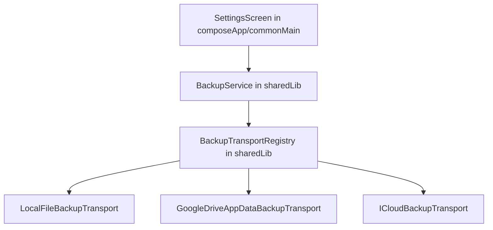
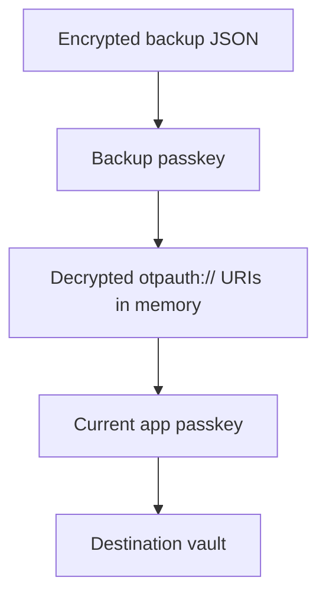
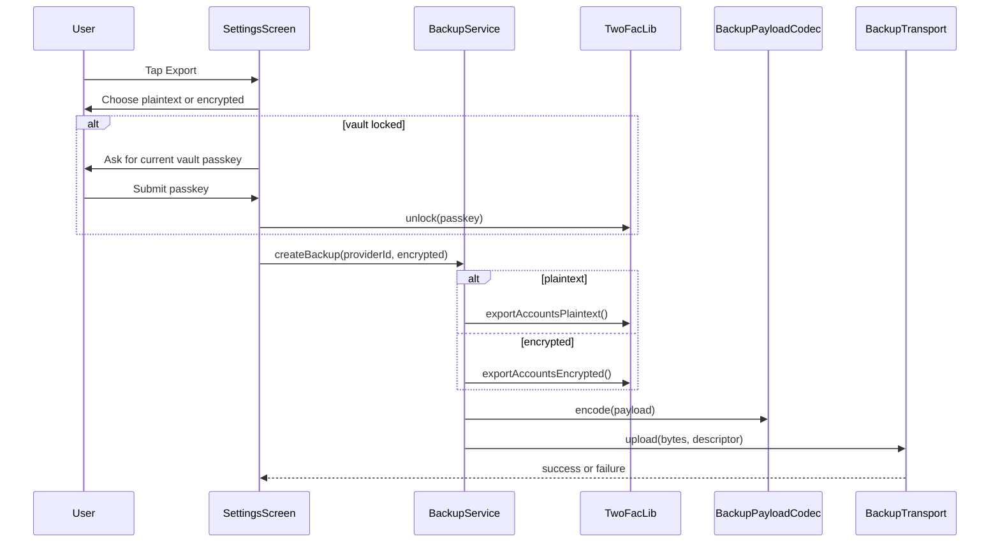
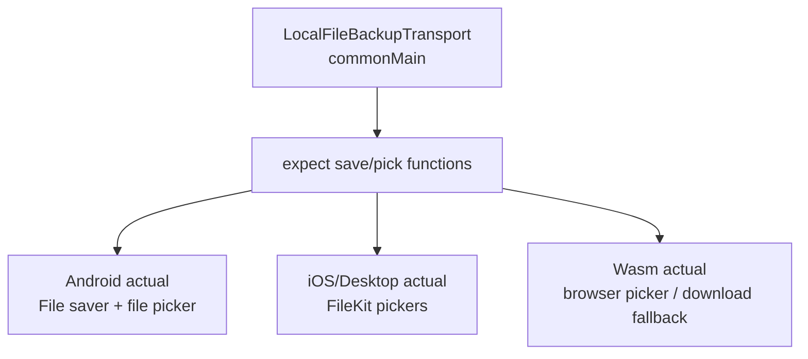
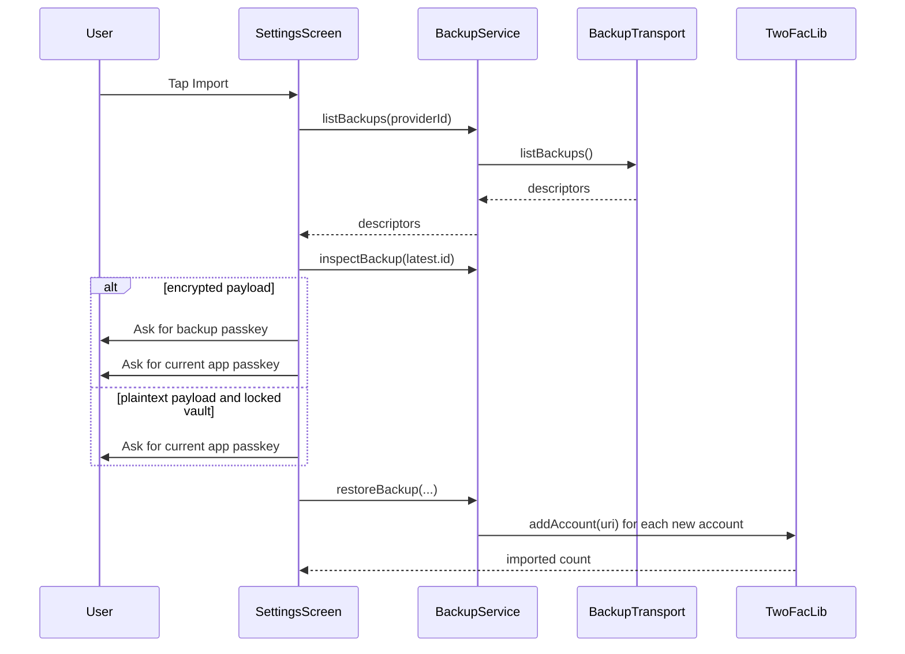

In the [previous post](https://arnav.tech/secure-session-management-in-twofac-android-ios-webauthn), I talked about how TwoFac unlocks secrets once they are already sitting on a device. This post is about the part that, in practice, caused me a lot more architectural pacing around the room: **how those secrets leave one device, survive a backup trip through Google Drive or iCloud or a plain old local file, and then come back into another vault without the shared core turning into a landfill of platform-specific code**.

Backup features always look suspiciously small in screenshots. There is a row in Settings, maybe two buttons, maybe a dialog that asks whether you want plaintext or encrypted export, and that is about it. But once you start actually implementing it, the tiny UI opens up into a whole chain of annoying but interesting questions. What does the file look like? Who owns the serialization? What exactly does "encrypted backup" mean? How do you let Android speak Drive and iOS speak iCloud while keeping `sharedLib` blissfully unaware of either one? And if future me wakes up one day and wants WebDAV or Dropbox, how much of this whole thing am I going to regret?

The shape I eventually settled on is pretty simple, and I mean that as a compliment. The shared library owns the **backup model, encoding, validation, and restore orchestration**. The app layer owns the **transport providers** that know how to push and pull bytes from a particular place. Once I arrived at that split, a lot of the rest of the design stopped fighting me.

## The Layered Backup Architecture

The center of this lives in `sharedLib/backup`, which is where all the boring but important stuff sits. That package defines:

- `BackupTransport`
- `BackupTransportRegistry`
- `BackupService`
- `BackupPayload` and `BackupPayloadCodec`
- `BackupDescriptor`, `BackupBlob`, `BackupProvider`, and `BackupResult`

Then `composeApp` steps in and contributes the concrete providers:

- `LocalFileBackupTransport`
- `GoogleDriveAppDataBackupTransport` on Android
- `ICloudBackupTransport` on iOS

The handoff point between those two worlds is Koin. `composeApp/commonMain` defines a `backupModule` that builds a shared `BackupTransportRegistry` out of `getAll<BackupTransport>()`, and then each platform module quietly contributes whichever transport instances it knows how to provide. So the shared layer never has to know whether a transport is backed by a browser save dialog, a Drive API call, or an iCloud ubiquity container. It just gets a registry full of providers and carries on with its life.



That seam is really the whole trick. `sharedLib` knows **what** a backup is, how to encode it, how to inspect it, and how to restore it safely. `composeApp` knows **where** a backup goes and how to get it back. Once you keep those two responsibilities from bleeding into each other, the code gets much calmer.

## What a Backup Looks Like on Disk

I wanted the backup file itself to be boring JSON, because boring file formats age well and are pleasant to debug when something goes wrong. In TwoFac, the payload is versioned by `schemaVersion`, and the codec currently accepts version 1 and version 2. Version 2 is the one that matters now because it supports both plaintext and encrypted exports.

At a high level, the payload carries:

- `createdAt`
- `encrypted`
- `accounts: List<String>` for plaintext `otpauth://` URIs
- `encryptedAccounts: List<EncryptedAccountEntry>` for encrypted account blobs

`BackupPayloadCodec` does more than turn objects into JSON and back again. It also validates the shape of the payload on the way in, which ends up mattering quite a bit because restore code is exactly the wrong place to be casual.

- version 1 backups cannot claim to be encrypted
- encrypted backups cannot also contain plaintext accounts
- plaintext backups cannot contain encrypted entries

That means malformed or mixed payloads fail early, before the restore path has a chance to touch the vault, and I am very fond of that kind of boring defensive behavior in security-sensitive code.

```mermaid
flowchart LR
    Vault["Unlocked vault"]
    Plain["Plaintext payload<br/>accounts = otpauth:// URIs"]
    Enc["Encrypted payload<br/>encryptedAccounts = accountLabel + salt + encryptedURI"]
    Json["Versioned JSON backup file"]

    Vault -->|exportAccountsPlaintext()| Plain
    Vault -->|exportAccountsEncrypted()| Enc
    Plain --> Json
    Enc --> Json
```

Backup files are named like `twofac-backup-<createdAt>-<sequence>.json`, which gives every transport a stable logical filename without forcing the shared layer to care whether that eventually becomes a local file name, an iCloud document name, or a Drive object name.

## Plaintext vs Encrypted Backups

This is the part users actually feel, and also the part where the internal design becomes visible in a nice way.

| Mode | What gets written | Export requirement | Restore requirement | Tradeoff |
| --- | --- | --- | --- | --- |
| **Plaintext** | Decrypted `otpauth://` URIs | Vault must be unlocked | Vault must already be unlocked, or the current app passkey must be supplied | Most portable, least safe if the file leaks |
| **Encrypted** | Existing encrypted account entries from storage | Vault must be unlocked | Needs the backup passkey and the current app passkey | Safer in transit and at rest, slightly more ceremony on restore |

The part I especially like here is how encrypted export works, because it would have been very easy to make this much messier than it needed to be.

TwoFac does **not** decrypt every account and then invent a second, special-purpose export format that happens to also be encrypted. Instead, `TwoFacLib.exportAccountsEncrypted()` returns the encrypted entries that already live in the vault. Each one contains:

- `accountLabel`
- `salt`
- `encryptedURI`

So an encrypted backup is, more or less, a structured export of the vault's encrypted account records as they already exist in storage, which keeps the model tidy and avoids a whole extra layer of backup-only crypto representation.

Restore then becomes a two-step process:

1. use the **backup passkey** to decrypt the encrypted backup entries into `otpauth://` URIs
2. use the **current app passkey** to add those URIs back into the destination vault, where they are encrypted again with the destination vault's key material

That is why encrypted restore can take accounts that were protected under one backup passkey and move them into a vault that uses another passkey, without ever needing to write the intermediate plaintext back out to disk.



## Export Flow in the App

From the app's point of view, export starts in exactly the place you would expect: `SettingsScreen`. The user taps **Export**, picks plaintext or encrypted mode in `BackupExportModeDialog`, and then the screen calls `BackupService.createBackup(providerId, encrypted = ...)`.

If the vault is locked, the UI asks for the current vault passkey first, which is a nice reminder that even backup is ultimately just another read of secret material. Once the vault is open, the shared layer takes over:



What I like about this flow is how little the screen has to know. `SettingsScreen` does not care whether the destination is Google Drive, iCloud, or a local JSON file the user picked five seconds ago. That entire concern disappears behind `BackupTransport`, which is exactly where I wanted it.

## How Local File Backup Works

The local provider is the simplest one to explain, but it is also a really nice example of how Kotlin Multiplatform lets you keep the shared code small without pretending every platform has the same file UI.

`LocalFileBackupTransport` itself lives in `composeApp/commonMain`, and its job is almost comically straightforward:

- export means "ask the platform to save these bytes somewhere"
- import means "ask the platform to pick a JSON file and return its bytes"

The actual picker behavior is delegated through `expect/actual` functions:

- `saveBackupFileWithPicker(...)`
- `pickBackupFileWithPicker()`

Which means the common transport stays tiny, while Android, iOS, Desktop, and Web each get to do their own native version of "please save this file somewhere sensible" without dragging those details back into common code.



There is one little detail in the import path that I think is especially cute. `LocalFileBackupTransport.listBackups()` does not scan a folder at all. It just opens the picker immediately, reads the selected file into memory, and exposes that one file as a one-item backup list. Which sounds a bit odd the first time you describe it out loud, but it means the rest of the restore pipeline can stay identical to the cloud providers.

So once the bytes are in memory, local file import effectively looks the same as "download a backup blob from some remote source", and the shared restore code gets to remain blissfully uninterested in where those bytes originally came from.


## How Android Uses Google Drive

On Android, the concrete provider is `GoogleDriveAppDataBackupTransport`.

I chose to back this with **Google Drive `appDataFolder`**, not the user's visible Drive folders, mostly because that felt like the least obnoxious user experience. It has a few nice side effects too:

- backup files do not clutter the user's regular Drive UI
- the app only needs the narrow `drive.appdata` scope
- the stored files remain app-scoped from a product point of view

The transport itself does three broad things:

1. checks availability by verifying Google Play Services and local OAuth config
2. authorizes through Google Identity's `AuthorizationClient`
3. performs list, upload, download, and delete through the Drive REST API

Upload uses multipart metadata plus the JSON content. The metadata marks the file as a child of `appDataFolder` and stores some app properties alongside it. Listing queries Drive for files under `appDataFolder`, filters down to TwoFac backup filenames, and turns the result into `BackupDescriptor`s that the shared layer knows how to work with.

And that is really the point: from the shared layer's perspective, Google Drive is just another thing that satisfies this interface:

```kotlin
interface BackupTransport {
    suspend fun listBackups(): BackupResult<List<BackupDescriptor>>
    suspend fun upload(content: ByteArray, descriptor: BackupDescriptor): BackupResult<BackupDescriptor>
    suspend fun download(backupId: String): BackupResult<BackupBlob>
    suspend fun delete(backupId: String): BackupResult<Unit>
}
```

All the Android-specific weirdness lives in `androidMain`, which is where it belongs. The shared code never has to learn about Play Services, consent flows, pending intents, or Drive request details, and I think that is a pretty good bargain.

## How iOS Uses iCloud

On iOS, the equivalent provider is `ICloudBackupTransport`.

This one is more direct, almost pleasantly so. It writes backup files into the app's iCloud ubiquity container, specifically under:

`Documents/TwoFacBackups`

Once the file lands there, iCloud Drive takes care of syncing it around.

The transport first checks whether:

- there is an active iCloud identity token
- the ubiquity container can be resolved

After that, it behaves like a filesystem-backed provider:

- `listBackups()` enumerates JSON files in the iCloud backup directory
- `upload()` writes the JSON bytes to the container URL
- `download()` reads the file back into memory
- `delete()` removes it

There is one practical wrinkle here, which will be familiar to anyone who has dealt with cloud-backed files on Apple platforms. A listed iCloud file may exist as a placeholder and not actually be downloaded locally yet. In that case the transport nudges iCloud to start downloading it and, if the bytes are still not ready, returns a clear failure instead of bluffing its way forward. I prefer that kind of honesty in transport code because it keeps the shared restore layer from making assumptions the platform cannot currently satisfy.

At the project level, the Xcode entitlements already declare the iCloud container and CloudDocuments support, so this transport fits pretty naturally into the existing iOS capability setup.

## How Import from Backups Works

The restore path is intentionally provider-agnostic, and that is probably the part I am happiest with because it means all the transport diversity collapses down into one shared flow once the bytes arrive.

In the current Settings UI, import goes roughly like this:

1. call `listBackups(providerId)`
2. pick the latest backup by `createdAt`
3. call `inspectBackup(...)` to decode and validate the payload before mutating the vault
4. if encrypted, ask for the backup passkey first
5. restore with `restoreBackup(...)`

For local files, "list backups" really means "open the picker right now and treat the selected file as the available backup", which sounds slightly funny but keeps the rest of the flow completely uniform.



Before `restoreBackup()` writes anything, it does a few useful bits of housekeeping:

- validates the payload
- parses all URIs first
- unlocks the destination vault if `currentPasskey` was supplied
- loads existing accounts
- skips accounts that are already equivalent

That last bit matters a lot in real life. If someone restores into a vault that already has some overlapping accounts, the experience should feel like a merge, not like a careless append operation that sprays duplicates everywhere.

## A Note on Automatic Restore

If you read through the shared backup package, you will notice an extra layer that is not fully visible from the current Settings UI yet: `BackupPreferences`, `BackupRemoteMarker`, and `BackupRestorePolicy`.

Those types model a future automatic-restore decision system:

- which provider is selected for automatic restore
- which remote marker was last observed
- which marker was already consumed by a successful restore
- whether a non-empty vault requires user confirmation

So the architecture is already leaning a little beyond manual export and import, even though the shipping flow in `SettingsScreen` is manual today. I like that the policy is already modeled in shared code because it gives future backup providers a clean place to plug into if I decide to make restore more proactive later on.

## Why This Architecture Makes New Providers Easy to Add


This is probably my favorite part of the whole design, mostly because it feels kind to future me.

If I want to add WebDAV, Dropbox, S3, or something else later, I do not have to reopen the payload model, rewrite restore semantics, or thread provider-specific conditionals through the UI. I just need to supply a new transport and register it with the appropriate DI module.

The shape is refreshingly small:

```kotlin
class WebDavBackupTransport(...) : BackupTransport {
    override val id: String = "webdav"
    override val displayName: String = "WebDAV"
    override val supportsAutomaticRestore: Boolean = true
    override val requiresAuthentication: Boolean = true

    override suspend fun isAvailable(): Boolean = ...
    override suspend fun listBackups(): BackupResult<List<BackupDescriptor>> = ...
    override suspend fun upload(content: ByteArray, descriptor: BackupDescriptor): BackupResult<BackupDescriptor> = ...
    override suspend fun download(backupId: String): BackupResult<BackupBlob> = ...
    override suspend fun delete(backupId: String): BackupResult<Unit> = ...
}
```

Then register it:

```kotlin
val webDavBackupModule = module {
    single<BackupTransport>(named("webdav")) {
        WebDavBackupTransport(...)
    }
}
```

Because `BackupTransportRegistry` is built from `getAll<BackupTransport>()`, the new provider becomes discoverable to the shared backup service automatically, which is exactly the kind of thing dependency injection ought to make easy.

So the checklist for a new provider is pleasantly short:

1. implement `BackupTransport`
2. choose a stable provider ID
3. map remote objects to `BackupDescriptor` and `BackupBlob`
4. handle provider-specific auth inside the platform layer
5. register the transport in the relevant Koin module
6. optionally integrate `BackupRestorePolicy` if the provider wants automatic restore semantics


That is the kind of abstraction boundary I always hope to end up with and do not always manage to get on the first try. The shared core stays focused on correctness and security. Platform modules stay focused on APIs, auth flows, and file transport. And future providers fit into the same slot instead of barging in and demanding a redesign.

## Closing Thoughts

TwoFac's backup system ended up being a really good example, at least for me, of the kind of problem Kotlin Multiplatform handles well when you let each layer stay honest about what it should own.

The shared core owns the things that genuinely should be uniform everywhere:

- payload schema
- validation
- restore semantics
- duplicate detection
- encryption-aware flow control

The platform layer owns the things that are unavoidably specific to the place the app is running:

- Google authorization
- iCloud container access
- file save and open dialogs
- browser save APIs

That separation is what makes the current set of providers feel clean today, and it is also what should make the next provider straightforward to add when I get around to it.

If you are building a cross-platform security app, this has felt like the right trade to me so far: centralize the data model and the policy, keep the transport edge thin and replaceable, and resist the temptation to let every provider drag its platform assumptions back into the shared core.
