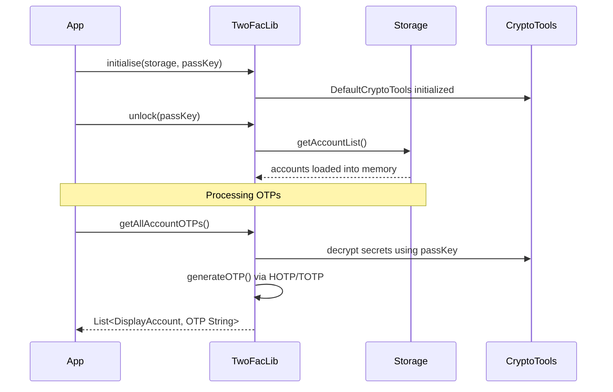
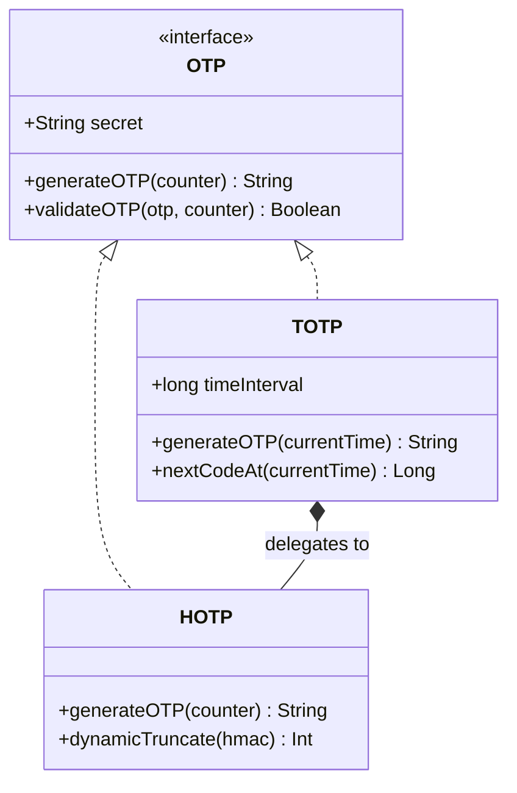
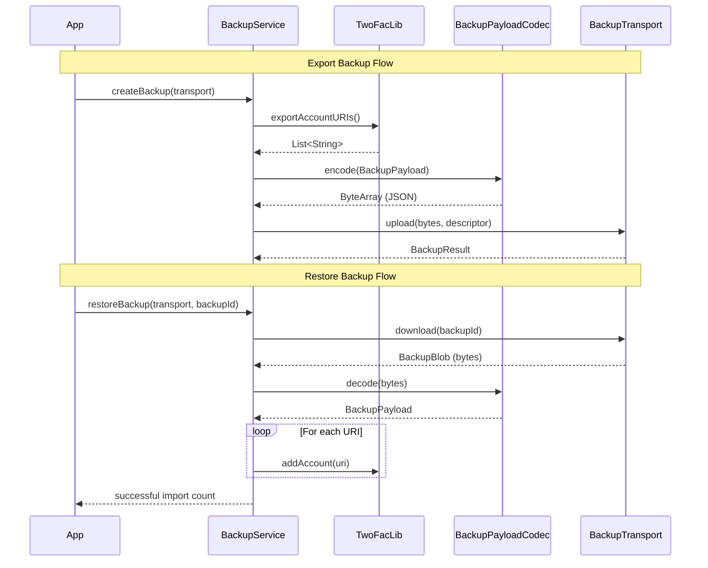

# sharedLib AGENTS.md

`sharedLib` contains cross-platform 2FA business logic and public APIs used by all apps.

## What lives here

- OTP engines: `otp/` (`TOTP`, `HOTP`)
- Parsing: `uri/OtpAuthURI.kt`
- Core facade: `TwoFacLib.kt`
- Import adapters: `importer/adapters/` (Authy, 2FAS, Ente)
- Storage contracts and models: `storage/`
- Crypto abstraction + defaults: `crypto/`

## Internal Architecture

### TwoFacLib Lifecycle
- **Initialization:** Created via `TwoFacLib.initialise(storage, passKey)`. This constructs the library, sets up cryptographic tools (`DefaultCryptoTools`), and connects the provided `Storage` interface.
- **Unlock & Load:** The library validates operations via an `isUnlocked()` check. Calling `unlock(passKey)` authenticates the session and loads all accounts from persistent storage into a volatile memory list (`accountList`). Memory is cleared when locked.
- **Adding & Saving Accounts:** Accounts are added by parsing an `OtpAuthURI`. The secret key is securely encrypted using a signing key derived from the user's `passKey` and a unique salt before invoking `storage.saveAccount()`. The memory cache is subsequently refreshed.
- **OTP Runtime Generation:** Function `getAllAccountOTPs()` regenerates signing keys on-the-fly to decrypt each account's secret and passes it to the corresponding OTP engine (`HOTP` or `TOTP`) to generate current codes, also returning the `nextCodeAt` expiration timestamp.

### Storage Operations
- The `Storage` interface dictates how accounts persist, requiring standard `getAccountList()`, `getAccount(id/label)`, and `saveAccount(StoredAccount)` operations.
- Platforms implement this utilizing SQLite, Files, or KeyStore defaults. `MemoryStorage` provides transient storage logic for testing or missing persistence environments.

### OTP Generation Algorithms (`HOTP` & `TOTP`)
- Both implement the `OTP` interface (`generateOTP`, `validateOTP`).
- **`HOTP`**: Uses standard HMAC processing (RFC 4226) against a numeric counter. Employs dynamic truncation (`dynamicTruncate`) extracting a 4-byte segment of the last block to form the final 6-8 digit code.
- **`TOTP`**: Internally relies on `HOTP`. Validates time-based windows (RFC 6238) by dividing the current Unix timestamp by the generic `timeInterval` (default 30 seconds) to compute the counter. Calculates expiration offsets via `nextCodeAt()`.

### Backup & Restore Transport
- **`BackupTransport` Interface:** Pluggable layer (`upload`, `download`, `listBackups`, `delete`) abstracting backup sinks like raw filesystem access or Drive/iCloud environments.
- **`BackupService` Orchestration:**
  - **Export Flow:** Extracts unencrypted data securely handling dependencies via `twoFacLib.exportAccountURIs()`, stamps it with metadata as a `BackupPayload`, encodes it via `BackupPayloadCodec`, and dispatches it over the transport channel.
  - **Restore Flow:** Downloads a `BackupBlob`, decodes it, and sequentially passes derived `otpauth://` URIs down to `twoFacLib.addAccount()` gracefully swallowing localized format ingestion errors.

## Targets

- `jvm` (Android/Desktop consumers)
- `native` (CLI + exported libs)
- `wasmJs` (web consumer)

## Testing focus

- Prefer `commonTest` for business logic behavior.
- Keep target-specific tests (`jvmTest`, `nativeTest`, `wasmJsTest`) for platform/provider differences.
